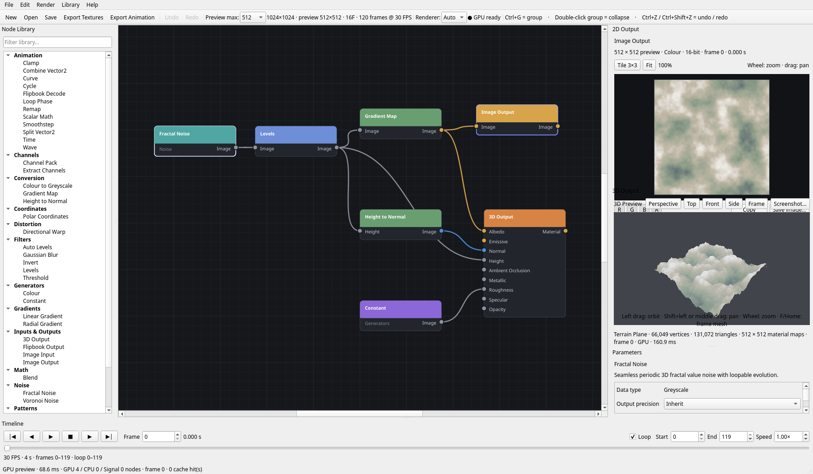

# VFX Texture Lab

VFX Texture Lab is a focused, node-based procedural texture, material and geometry authoring tool for VFX artists.

Version **0.49.0** establishes the first reusable Geometry operation toolkit: Transform, Subdivide, explicit Normals and a VFX-focused Disc / Ring generator. Geometry Displace now preserves authored normals so shading changes happen only when the artist requests them.

## Geometry Toolkit Foundation in 0.49.0

- **Geometry Transform** moves, rotates and scales any incoming mesh around its current origin or bounds centre. The output keeps the incoming export pivot, making it the practical companion to Geometry Combine.
- **Geometry Subdivide** adds four triangles per source triangle per level. With Smooth Surface disabled it preserves the authored shape for higher-detail displacement; enabled smoothing progressively relaxes closed surfaces.
- **Geometry Normals** explicitly rebuilds Smooth, angle-limited or Flat normals and can flip normal direction or reverse triangle winding.
- **Geometry Disc / Ring** creates full or partial discs, annuli and arcs with Planar or Radial Strip UVs, shared origin/rotation controls and integer U/V tiling for shockwaves, portals and ground effects.
- **Geometry Displace** now changes vertex positions only and leaves incoming mesh normals untouched. Place Geometry Normals after it only when the deformed surface should drive vertex shading.

See [`docs/GEOMETRY_TOOLKIT.md`](docs/GEOMETRY_TOOLKIT.md) and [`docs/TESTING_0.49.0.md`](docs/TESTING_0.49.0.md).

## Geometry Generator Rotation in 0.48.8

- **Rotation X / Y / Z** are now available on Geometry Plane, Box and Cylinder.
- Rotation happens after Origin placement, so the visible pivot gizmo is the exact point the mesh rotates around.
- Each axis has a full -360° to +360° slider range, with additional turns accepted in the numeric editor.
- Plane and Cylinder Orientation remains a convenient base direction; the shared XYZ rotation is applied afterwards.
- Positions and vertex normals rotate together, so Material preview, Geometry Displace and OBJ export remain consistent.

## Geometry Operations and Cylinder Taper in 0.48.7

- **Geometry Combine** joins Top and Bottom Geometry into one indexed mesh and one OBJ export while retaining the Bottom input origin as the shared pivot. It is a mesh concatenation operation, not a weld or boolean union.
- **Geometry Displace** samples a Greyscale Height input through mesh UVs and moves vertices along their normals with a signed Multiplier. Version 0.49.0 moved normal rebuilding into the explicit Geometry Normals node.
- The displacement height branch evaluates at the current timeline frame. Live preview uses preview-scale sampling while OBJ export uses the full document resolution.
- **Geometry Cylinder** now has additive Top Radius Offset and Bottom Radius Offset controls. Negative offsets can collapse an end to a clean cone tip; positive offsets produce wider tapered ends and frustums.

## Material Focus Playback Integrity in 0.48.6.1

- GPU textures are published to the shared graph cache only after their complete command batch and display finalisation succeed.
- Cancelling Material work during a focus change releases its private textures instead of leaving an incomplete frame available for later reuse.
- Each playback focus session has its own generation and monotonically increasing request serial, so stale 2D or 3D presentations are rejected.
- Adaptive playback now uses only 256 px and 128 px power-of-two tiers, with sustained-pressure hysteresis before lowering quality.

## Smooth Material 2D Playback in 0.48.6

- Every completed focused-Material frame now reaches the 2D Base Colour preview immediately; the former 15 FPS cap has been removed.
- The 2D and 3D outputs present independently from the same material evaluation result, so 2D no longer waits for the 3D viewport cadence.
- A lightweight RGBA8 frame-swap path avoids rebuilding preview chrome on every animation frame.
- No duplicate Base Colour graph evaluation has been reintroduced.

## Smooth Material Playback in 0.48.5

- Material evaluation and viewport presentation now overlap instead of running serially on every frame.
- Only the newest completed frame is retained, preventing latency from building when the playhead advances faster than evaluation.
- Live material maps adapt between 256, 192 and 128 px according to measured frame cost, then return to the selected full-quality resolution when playback stops.
- Playback suppresses detailed inspector/progress UI work, throttles the 2D Base Colour display and leaves unchanged GPU texture views and bind groups resident.
- Connected procedural geometry is no longer re-evaluated merely to construct every animated Material request key.

## Material Playback Performance in 0.48.4

- A focused Material now has one playback evaluation stream: its Base Colour feeds the 2D Preview while the same result updates the full 3D material.
- Static channels such as Constant Roughness or Metallic are evaluated once and remain resident instead of being rebuilt every frame.
- Renderer uploads are incremental, so an animated Base Colour no longer forces unchanged Height, Normal, Roughness, Metallic and other maps to upload again.
- Direct Constant and Colour inputs stay as compact 1 × 1 textures.
- Live playback uses a bounded 256 px material-map resolution for responsiveness; pausing automatically restores the selected full-quality viewport resolution.
- Material playback on connected procedural Geometry uses the same optimised path.

## Geometry Pivot and UV Controls in 0.48.3

- **Origin X / Y / Z** are now available on Geometry Plane, Box and Cylinder. These shift the generated mesh so the export pivot can sit at the centre, a base, an edge, a corner or any point in between.
- **UV Tiles U / V** are now available on Geometry Plane, Box and Cylinder as integer parameters. This keeps repeated texture seams predictable while allowing deliberate U/V tiling differences.
- The 3D Preview now shows a small non-interactive **pivot gizmo** while a Geometry node is focused, so origin placement is visible directly in the inspection viewport.

## Geometry Generator Expansion in 0.48.2

- **Geometry Box** creates hard-edged six-face meshes with Width, Height, Depth and independent subdivisions on X, Y and Z. Each face keeps its own 0–1 UV square, making tiled procedural materials immediately usable.
- **Geometry Cylinder** creates capped or uncapped cylinders with Radius, Height, radial/height/cap segmentation, an explicit wall UV seam and selectable **Axis X / Y / Z** orientation.
- Cylinder side normals can be **smooth** or **faceted**, which makes it useful both for ordinary preview geometry and for testing topology-dependent material behaviour.
- Box and Cylinder were introduced with centred placement; 0.48.3 replaced that temporary toggle with shared Origin X/Y/Z controls.
- The 3D Preview wireframe modes from 0.48.1 continue to apply, so focused Geometry nodes remain easy to inspect as shaded solids with visible topology.

## Geometry Preview Polish in 0.48.1

- The 3D Preview can now render a true wireframe overlay on top of shaded geometry.
- Wireframe mode is **Auto**, **Always** or **Off**, with **Auto** showing wireframe only while a Geometry node is focused.
- The stale Geometry Plane CPU/WGSL error badge has been removed by keeping delayed preview dispatches on the dedicated geometry path.

## Geometry Foundation in 0.48.0

- Added a new strongly typed **Geometry** data type with its own coral sockets and wires, incompatible with image, normal, material or signal sockets without an explicit future conversion.
- Added **Geometry Plane**, producing indexed triangles, positive-axis vertex normals and 0–1 UVs with independent X/Y subdivisions and horizontal/vertical orientation.
- Focusing a Geometry-producing node temporarily replaces the normal viewport primitive with neutral shaded geometry inspection. Leaving Geometry focus restores the ordinary selected preview mesh.
- Added an optional **Geometry** input to **Material**. When connected, focusing the Material previews its PBR channels on that mesh; without a connection, existing preview-mesh behaviour is unchanged.
- Added **Geometry Output** with remembered Quick Export and configurable Wavefront OBJ export, including optional UVs, normals and V flipping.
- Geometry flows through reroutes, Send/Receive portals, Graph Input/Output interfaces and nested Graph Instances, and survives graph save/load. Geometry graph-asset inputs are always treated as required because there is no implicit default mesh.
- The mesh evaluator is resolution-independent and separate from the established image evaluator/cache/backend path.

See [`docs/GEOMETRY_FOUNDATION.md`](docs/GEOMETRY_FOUNDATION.md), [`docs/TESTING_0.48.1.md`](docs/TESTING_0.48.1.md), [`docs/TESTING_0.48.2.md`](docs/TESTING_0.48.2.md), [`docs/TESTING_0.48.2.1.md`](docs/TESTING_0.48.2.1.md) and [`docs/TESTING_0.48.3.md`](docs/TESTING_0.48.3.md).

For generator rotation, see [`docs/TESTING_0.48.8.md`](docs/TESTING_0.48.8.md). For the operations and tapered cylinder, see [`docs/TESTING_0.48.7.md`](docs/TESTING_0.48.7.md).

For the current playback pass, see [`docs/TESTING_0.48.5.md`](docs/TESTING_0.48.5.md). The original bridge optimisation checklist remains in [`docs/TESTING_0.48.4.md`](docs/TESTING_0.48.4.md).

## Crystal 1 reconstruction in 0.47.0.6

- Two independently randomised periodic Voronoi distance fields form the source structure.
- Each field is curved with `sqrt(1 - A²)`, then the relative difference between their minimum and maximum produces the dark faceted pattern.
- **Scale X** and **Scale Y** directly control feature-point density on each axis.
- Seed and loopable Evolution remain available; Contrast, Balance and Invert provide the standard final remap.
- The discarded Disorder and Facet Sharpness controls have been removed.

See [`docs/FOUNDATIONAL_NOISE_EXPANSION.md`](docs/FOUNDATIONAL_NOISE_EXPANSION.md) and [`docs/TESTING_0.47.0.6.md`](docs/TESTING_0.47.0.6.md).

## Moisture Noise reconstruction in 0.47.0.5

- The generator starts from neutral grey and sums several periodic positive and negative deposit layers rather than selecting the strongest cell.
- Broad damp regions come from a low-frequency value-noise mask; Fine Detail adds separate condensation and micro-speckle layers.
- **Pool Size**, **Fine Detail**, **Patchiness** and **Disorder** are the only moisture-specific controls.
- Pattern Size X/Y, Pattern Angle, Softness, Global Opacity and generic directional-disorder controls were removed because they belonged to the incorrect cell-based construction.
- The NumPy and WGSL paths remain seamless, deterministic and loopable.

See [`docs/FOUNDATIONAL_NOISE_EXPANSION.md`](docs/FOUNDATIONAL_NOISE_EXPANSION.md) for the construction and [`docs/TESTING_0.47.0.5.md`](docs/TESTING_0.47.0.5.md) for the focused artist checklist.

## Anisotropic Noise reconstruction in 0.47.0.4

- The generator now produces long horizontal strips by interpolating a periodic random-value lattice with few X subdivisions and many Y subdivisions.
- **Scale X** controls how often strip values change along their length; **Scale Y** controls the number and density of strips.
- **Smoothness** controls how wide the horizontal transitions are.
- **Interpolation** blends linear and Hermite transition curves.
- Seed, Evolution and Loop Cycles remain deterministic and exactly loopable.
- Removed the old Lines per Cell, Stretch, Strip Width, angle variation, luminance variation and generic disorder controls because they described a strand scatter rather than anisotropic noise.

## BnW Spots 3 and Crystal reconstruction in 0.47.0.3

- **BnW Spots 3** smoothly fades every Gaussian deposit to zero before the finite sparse-convolution search ends. A wider 5×5 periodic neighbourhood retains the large soft kernels without hidden derivative discontinuities.
- **Crystal 1** combines two independently offset angular Worley fields, planar per-cell facet coordinates and dark cell boundaries. It is intentionally darker and more angular than ordinary Voronoi/Worley noise.
- **Crystal 2** uses continuous, periodic triangular fold planes arranged into long directional creases. It is intended for subtle cloth, marble and crystalline breakup rather than isolated line stamps.
- The Crystal nodes no longer inherit the generic directional-disorder block. Each now exposes exactly one **Disorder** parameter, with no duplicate labels or ineffective Disorder Scale/Anisotropy/Angle controls.
- New regressions inspect image gradients as well as pixel values, preventing the BnW Spots 3 normal-map seam from returning.

## BnW Spots reconstruction in 0.47.0.2

The original BnW nodes were incorrectly built from the same fractal families already used by our ordinary noise library. The rebuilt nodes use randomly positioned positive and negative Gaussian kernels at several scales—a periodic sparse-convolution process—so their visible structure comes from actual deposits and speckles.

- **BnW Spots 1**: strong multiscale black/white deposits with dense rough grain.
- **BnW Spots 2**: broad mottling covered by much finer high-frequency speckles.
- **BnW Spots 3**: broader, softer spot fields with restrained granular detail.

Existing graph parameters remain valid. Roughness changes the middle-scale deposit contribution, while Fine Grain controls the high-frequency impulse layer.

## Cloud reconstruction in 0.47.0.1

- **Clouds 1** uses several dense value-noise frequency bands for fine layered wisps.
- **Clouds 2** favours low-frequency value-noise masses with restrained detail for broad vapour.
- **Clouds 3** combines body, middle and fine value-noise bands into darker mottled breakup.
- Cloud Disorder now uses a separate gentle value-noise warp; it does not reuse the gradient displacement used by turbulence-oriented generators.
- Existing cloud parameters and graphs remain compatible.

## Foundational Noise Expansion in 0.47.0

- **Clouds 1, 2 and 3** are separate value-noise cloud constructions for fine wisps, broad vapour and dense mottled breakup rather than presets of one node.
- **BnW Spots 1, 2 and 3** use signed sparse Gaussian deposits for high-contrast multiscale spots, fine-speckled mottling and broad soft spot fields.
- **Crystal 1** creates dark angular dual-Worley facets; **Crystal 2** creates long continuous triangular cloth/crease planes with art-directed direction and strength.
- **Fractal Sum** exposes Minimum/Maximum Level, Roughness and Global Opacity for precise octave-band construction.
- **Anisotropic Noise**, **Fibres**, **Messy Fibres** and **Fur** cover orderly directional strips through strongly warped, broken and tapered strands.
- **Moisture Noise** combines positive and negative soft pools with low-frequency organic variation.
- Shared controls provide deterministic Seed, exact loopable Evolution/Loop Cycles, Contrast, Balance and Invert where appropriate. Node-specific Disorder controls are used where the generator requires them.
- All fourteen nodes compile through one branch-based WGSL kernel while retaining individually authored parameter sets and visual identities.

See [`docs/FOUNDATIONAL_NOISE_EXPANSION.md`](docs/FOUNDATIONAL_NOISE_EXPANSION.md) for the generator model and [`docs/TESTING_0.47.0.md`](docs/TESTING_0.47.0.md) for the focused artist checklist.

## Directional Lighting in 0.46.5.1

- Feed any tangent-space normal map into **Directional Lighting** to derive a grayscale lighting or selection mask without first reconstructing height.
- **Light Angle** controls the horizontal direction toward the light and **Light Elevation** moves between grazing and overhead illumination.
- **Diffuse Power** adjusts broad mask contrast while **Diffuse Brightness** controls its strength.
- Optional **Highlight Power** and **Highlight Brightness** add a view-facing specular-style lobe that is useful for stylised material masks.
- **Ambient** lifts fully unlit regions and **Invert** swaps the mask convention.
- OpenGL `+Y` and DirectX `-Y` inputs produce equivalent decoded lighting.
- The 2D Preview gizmo edits angle and elevation together: the outer guide represents grazing light, while the centre represents overhead light.
- NumPy and native WGSL paths share the same normal decoding and light-response model; the GPU path is one compute pass with no readback.

See [`docs/DIRECTIONAL_LIGHTING.md`](docs/DIRECTIONAL_LIGHTING.md) for the model and [`docs/TESTING_0.46.5.1.md`](docs/TESTING_0.46.5.1.md) for the focused artist checklist.

## Splatter Circular in 0.46.5

- Arrange up to **64 patterns per ring** across as many as **10 concentric rings**, or reduce Arc Spread to create partial radial arrays.
- First Ring Radius, Ring Spacing, per-ring Rotation Offset, Spiral Amount and deterministic radial/angular variation provide a complete circular placement model.
- Built-in grayscale shapes are available immediately, while four custom Pattern inputs can be selected singly, distributed randomly, sequenced around a ring or assigned one per ring.
- Face Outward, Face Centre, Tangent and Fixed orientation modes keep petals, runes, strips and directional VFX elements aligned intentionally.
- Uniform/independent sizing, ring and around-ring scale progression, random removal, luminance progression and deterministic seeding support controlled variation.
- **Connect Patterns** derives pattern width from the chord between neighbouring instances, making continuous rings, chains, bands and petal structures practical.
- Maximum, Add, Subtract and Replace compositing can work over a constant value or connected grayscale Background input.
- The 2D Preview gizmo directly edits Centre, First Ring Radius, outer Ring Spacing and Ring Rotation while preserving the Inspector as the authoritative parameter editor.
- The NumPy reference path and dedicated WGSL compute shader use the same deterministic placement model; interactive evaluation temporarily caps especially large authored arrays to keep dragging responsive.

See [`docs/SPLATTER_CIRCULAR.md`](docs/SPLATTER_CIRCULAR.md) for the complete model and [`docs/TESTING_0.46.5.md`](docs/TESTING_0.46.5.md) for the focused artist checklist.

## Transform quality in 0.46.4

- **Automatic, Nearest, Bilinear and Bicubic** filtering are now shared across Transform 2D, the dedicated Tile/Offset/Rotate/Scale nodes, Crop, Auto Crop, Perspective Transform, Clone Patch, Atlas Splitter, Normal Transform and their material-aware wrappers where applicable.
- **Automatic** uses cubic reconstruction for enlargement and ordinary resampling, then switches to a wider area-aware footprint when a transform minifies the source.
- **Transparent, Clamp, Seamless / Wrap and Mirror** boundaries use one definition across the general transform family. Legacy Tile/Wrap booleans migrate without changing their authored behaviour.
- Colour cutouts are filtered in premultiplied-alpha form to prevent transparent-edge colour fringes. Grayscale and height data remain numeric; normal/vector data is decoded, interpolated and renormalised.
- Identity transforms and integer-pixel moves preserve source texels exactly. Rotation and transform gizmos now operate in physical pixel space, so rectangular canvases no longer squash geometry or disagree with the 2D Preview.
- **Safe Transform** remains a distinct node. It always samples periodically and adds integer-lattice tile-safe rotation, pixel-snapped manual/random offsets, symmetry and automatic/manual detail prefiltering without turning Transform 2D into a super-node.

See [`docs/TRANSFORM_QUALITY.md`](docs/TRANSFORM_QUALITY.md) for the shared rules and [`docs/TESTING_0.46.4.md`](docs/TESTING_0.46.4.md) for the focused artist checklist.

## Normal Vector Rotation in 0.46.3.1

- **Normal Vector Rotation** rotates each decoded tangent-space normal around its local Z axis while leaving every texel at the same UV coordinate.
- It is intentionally distinct from **Normal Transform**, which moves/rotates the texture and rotates its vectors with the image.
- Rotation supports arbitrary positive or negative turns, animation and explicit OpenGL `+Y` / DirectX `-Y` encoding.
- Results are renormalised on both NumPy and WGSL paths, and a flat normal remains an exact flat normal at every angle.

See [`docs/NORMAL_HEIGHT_PROCESSING.md`](docs/NORMAL_HEIGHT_PROCESSING.md) for behaviour and [`docs/TESTING_0.46.3.1.md`](docs/TESTING_0.46.3.1.md) for the focused checklist.

## Normal and height processing in 0.46.3

- **Normal Blend** crossfades two tangent-space normal maps through an optional mask and renormalises the result.
- **Normal Combine** layers detail over a base normal using Reoriented Normal Mapping (RNM), Whiteout or UDN, with independent strengths and masking.
- **Normal Normalize** repairs non-unit or invalid vectors; **Normal Invert** flips selected X, Y or Z axes with explicit OpenGL/DirectX convention handling.
- **Normal Vector Rotation** changes the tangent-space direction without moving the image.
- **Normal Transform** moves, tiles, rotates and independently stretches a normal map while rotating the tangent vectors with the image. It shares the direct 2D Preview move/scale/stretch/rotate gizmo used by Transform 2D.
- **Normal to Height** performs a global Poisson integration with low/high-frequency balance, intensity, normalisation and inversion. It reconstructs a useful approximate height field, but cannot recover absolute height information that was absent from the normal map.
- **Bent Normal** reuses the software height-field ray traversal developed for RTAO and records the average unoccluded direction as a tangent-space normal.
- **RT Shadows** ray-marches directional hard or soft shadows over a height field with light angle/elevation, height scale, distance, samples, bias, strength and tile/clamp boundaries.
- Ordinary normal utilities and RT Shadows have native WGSL execution. Bent Normal stays GPU-resident through ray tracing and two height-aware denoise passes. Normal to Height intentionally performs one global GPU-to-CPU solve and uploads the reconstructed map because its FFT/Poisson integration requires whole-image frequency-domain access.

See [`docs/NORMAL_HEIGHT_PROCESSING.md`](docs/NORMAL_HEIGHT_PROCESSING.md) for behaviour and controls and [`docs/TESTING_0.46.3.md`](docs/TESTING_0.46.3.md) for the focused artist checklist.

## Perspective direction and Transform 2D stretching in 0.46.2.2

- **Perspective Transform** now treats its four handles as destination corners. Moving the top pair inward makes the top of the source visibly narrower instead of selecting a smaller source trapezoid and expanding it.
- Perspective handles remain visible and editable directly over the processed node result; the former **Edit source** toggle is no longer shown for this node.
- Transparent perspective output now agrees between CPU and GPU paths for greyscale as well as colour/vector inputs.
- **Transform 2D** retains Uniform Scale and adds independent **Scale X** and **Scale Y** controls.
- Corner handles change Uniform Scale, side handles stretch or squash one axis, the centre moves and the external circular handle rotates.
- Existing graphs keep their authored Uniform Scale and receive neutral `1.0` X/Y stretch values.
- **Crop** deliberately retains a renamed **Edit crop source** mode because its bounds are source-space coordinates that are remapped to the full output; drawing those same bounds over the processed result would always collapse to the output edges and provide no useful positioning reference.

See [`docs/PHOTOGRAMMETRY_AND_SCANS.md`](docs/PHOTOGRAMMETRY_AND_SCANS.md) for current behaviour and [`docs/TESTING_0.46.2.2.md`](docs/TESTING_0.46.2.2.md) for the focused checklist.

## Photogrammetry and scan preparation in 0.46.2

- **Perspective Transform** warps the complete source into an authored destination quadrilateral using a true projective homography; 0.46.2.2 corrects the original reversed handle direction.
- **Lighting Equalisation** removes broad illumination or colour cast while preserving local surface detail.
- **Clone Patch** copies, rotates, scales and feathers a source patch over unwanted features, with an optional destination mask.
- **Make It Tile Photo** provides the photographic seam-repair stage; 0.46.2.1 replaces its original blurred-seam implementation with centred-source warped cut masks.
- **Atlas Splitter** detects disconnected irregular atlas elements and extracts one by selection index; a regular square grid is not required.
- **Material Crop** and **Material Make It Tile** apply coherent operations lazily across authored PBR channels and preserve material settings. Normal/vector channels are renormalised after resampling.
- The image filters use native WGSL execution. Atlas Splitter performs one component-analysis readback because connected-component selection is global; material wrappers evaluate only the requested channel rather than eagerly processing every PBR map.

See [`docs/PHOTOGRAMMETRY_AND_SCANS.md`](docs/PHOTOGRAMMETRY_AND_SCANS.md) for the current behaviour and [`docs/TESTING_0.46.2.md`](docs/TESTING_0.46.2.md) for the original milestone checklist.

## Immediate essential filters in 0.46.1

- **Histogram Select** isolates a centred value band with Position, Range and Contrast and uses the shared live histogram editor.
- **Highpass** extracts fine detail around visible neutral grey, handles greyscale and linear-light colour correctly, and can clamp photographs or wrap tileable sources.
- **Edge Detect** provides resolution-independent Scharr and Sobel masks with perceptual colour and decoded normal/vector handling.
- **FXAA** smooths procedural jaggies in greyscale, colour and normal/vector maps; vector results are renormalised after filtering.
- **Crop** remaps authored rectangular bounds to the output with Nearest or Bilinear sampling.
- **Auto Crop** detects luminance or alpha content and can crop, square, preserve aspect ratio or stretch it to the output.
- Every node has a NumPy reference and native WGSL execution path. Auto Crop performs one global content-bound readback before its GPU resample; the other five remain GPU-resident end to end.

See [`docs/IMMEDIATE_ESSENTIALS.md`](docs/IMMEDIATE_ESSENTIALS.md) for behaviour and controls and [`docs/TESTING_0.46.1.md`](docs/TESTING_0.46.1.md) for the focused artist checklist.

## Ray-traced ambient occlusion in 0.46.0.4

- **Ambient Occlusion (RTAO)** traces a configurable hemisphere of rays through the input Height surface using the existing WebGPU compute backend; hardware ray-tracing support is not required.
- Height Scale, Samples, Distribution, Maximum Distance and Spread Angle define the visibility solve, with tileable wrapping or clamped boundaries.
- Deterministic per-pixel ray rotation removes fixed radial patterns, while first-hit termination and near-surface-biased march steps keep the workload practical.
- A separable height-aware denoiser removes stochastic ray noise without smearing lower-surface AO over raised shapes.
- Interactive edits temporarily use six rays and eight steps; the selected 4–64 ray count returns when the edit settles.
- HBAO remains available for routine fast work, while RTAO is intended for more accurate settled previews and final output.

See [`docs/RTAO.md`](docs/RTAO.md) for behaviour and controls and [`docs/TESTING_0.46.0.4.md`](docs/TESTING_0.46.0.4.md) for the focused artist checklist.

## Blend colour-space correction in 0.46.0.3

- Standard colour Blend modes now convert linear-light graph RGB to display-sRGB for the artistic blend calculation, then return the result to linear light for downstream processing.
- A visible 50% grey from Gradient Map is exactly neutral in **Overlay**, **Soft Light**, **Hard Light** and **Add Sub / Linear Light** instead of darkening the background.
- Greyscale and vector/data branches continue to use raw 0–1 numeric blend mathematics, so height, masks and technical maps do not receive an unintended gamma transfer.
- Mixed colour/greyscale blends interpret the greyscale branch as a visible display value when the result is colour, avoiding the old bright 0.5-linear conversion error.
- All 16 modes, opacity masks, alpha handling, divide/dodge/burn boundaries and CPU/WGSL agreement have focused regression coverage.

See [`docs/BLEND.md`](docs/BLEND.md) for the colour/data behaviour and [`docs/TESTING_0.46.0.3.md`](docs/TESTING_0.46.0.3.md) for the focused artist checklist.

## HBAO edge-aware reconstruction in 0.46.0.2

- Hard height steps now use a slope-limited tangent estimate, eliminating the false one-pixel black outline previously produced around Tile Sampler circles and other binary shapes.
- Raw horizon samples are reconstructed by a separable joint bilateral filter, removing visible rings and sample footprints without blurring dark ground AO onto raised white surfaces.
- Reconstruction scale follows Radius and document resolution and remains entirely GPU-resident; interactive edits use a bounded lighter reconstruction width.
- Upper silhouettes remain unoccluded, nearby lower surfaces retain soft contact AO, and the falloff becomes continuous rather than a stack of recognisable sampled shapes.

See [`docs/TESTING_0.46.0.2.md`](docs/TESTING_0.46.0.2.md) for the focused hard-edge and smoothness checklist.

## HBAO quality refinement in 0.46.0.1

- HBAO now samples equal-area concentric rings instead of repeatedly taking maxima along a small set of identical radial rays.
- Every ring is rotated by a low-discrepancy golden-angle offset, removing the obvious flower/petal duplication around isolated height features.
- Floating-point bilinear height taps replace rounded integer offsets, so small circles and thin details produce continuous halos rather than stepped spokes.
- Height Depth uses a compressed physical scale and angular response, keeping the full `0–1` range visually useful instead of effectively saturating around `0.6`.
- Quality now increases both angular coverage and radial coverage; interactive editing retains a reduced 4-direction, 3-ring draft path.

See [`docs/TESTING_0.46.0.1.md`](docs/TESTING_0.46.0.1.md) for the focused HBAO comparison checklist.

## Surface analysis in 0.46.0

- The former terrain **Curvature** node is now named **Height Curvature**, preserving its stable type ID and all existing graph connections while making its height-map role explicit.
- **Curvature** converts tangent-space normals into a sharp signed curvature map, with exact 50% grey on flat regions for neutral Overlay blending.
- **Curvature Sobel** provides the broader, harder stylised edge treatment, with OpenGL/DirectX normal convention handling.
- **Curvature Smooth** combines three resolution-aware scales and exposes Curvature, Convexity and Concavity outputs.
- **Ambient Occlusion (HBAO)** builds tileable AO from a height map using local-tangent, rotated concentric sampling with 4/8/16-direction quality levels and a reduced-cost interactive draft path.
- Every new node has matching NumPy and WGSL implementations and remains GPU-resident in ordinary graph evaluation.

See [`docs/SURFACE_ANALYSIS.md`](docs/SURFACE_ANALYSIS.md) for the node behaviour and [`docs/TESTING_0.46.0.md`](docs/TESTING_0.46.0.md) for the focused artist test plan.

## Viewport-owned displacement in 0.45.3

- Material nodes continue to author the raw **Height** channel, but no longer own how far the current inspection mesh is displaced.
- **3D Preview → Settings… → Displacement** now contains Amount, Height Midpoint and Invert Height.
- These controls update renderer uniforms against the already uploaded Height texture; they do not invalidate nodes, resolve material channels again or upload the texture set again.
- Displacement settings and camera/viewport presentation are saved per `.vfxgraph`.
- Graph-format 18 migration transfers legacy per-material values into the viewport and removes the obsolete hidden parameters.

See [`docs/TESTING_0.45.3.md`](docs/TESTING_0.45.3.md) for the focused displacement ownership and live-update checklist.

## Export template sharing in 0.45.2

- Export templates now carry a stable Template ID, description, author, version and engine/purpose metadata.
- **Import .vfxexport…** and **Export .vfxexport…** share complete file layouts and RGBA channel assignments as versioned JSON files.
- **Library → User Export Templates…** manages installed templates with install, update, side-by-side, remove, refresh and reveal-folder actions.
- Installed templates appear as starting points in the Export Template Editor and as selectable layouts in Multi-Target Export.
- Selecting a user template snapshots it into the graph-local target, so existing graphs continue to work even when the global template is later removed.
- `.vfxpackage` export can include graph-local templates as separately installable `.vfxexport` files while preserving the embedded definitions required by the graph itself.
- Package installation offers conflict-safe template installation using Update, Side by Side or Skip.
- `.vfxexport` files opened through the OS or command line are treated as installable templates.

See [`docs/TESTING_0.45.2.md`](docs/TESTING_0.45.2.md) for the focused export-template sharing and package checklist.

## Export templates in 0.45.0.1

- Every Texture Set Output preset runs through the same reusable file-and-channel template model.
- Built-ins include Generic PBR Separate, Unreal ORM, Unity HDRP Mask Map, Godot ORM and VFX RGBA Masks.
- **Customise Template…** opens a graph-local editor where output files can be added, duplicated or removed and each R/G/B/A channel can receive a material channel component, luminance, Constant 0/1 or an inverted source.
- File definitions control format, bit depth, Grayscale/RGB/RGBA layout, sRGB/Linear handling and optional per-file naming patterns.
- Export Outputs includes a Planned Files preflight with resolved filenames, encoding/depth details, duplicate warnings and template diagnostics.
- Custom templates are saved inside the graph and therefore travel naturally with self-contained exports and `.vfxpackage` archives.

See [`docs/TESTING_0.45.0.1.md`](docs/TESTING_0.45.0.1.md) for the focused scalar-export regression checklist.

## Package image sources in 0.44.3.1

- Package export now offers **Include source image files in the package**, enabled by default.
- Exact imported image bytes are stored under `resources/images/` so recipients can inspect, edit or relink them after extraction.
- Embedded fallback copies remain inside the entry graph so **Open Temporarily** still works directly and reliably.
- Identical image sources are included once and referenced by every matching Image Input use in the package manifest.
- Extracted and installed graphs expose **Use Included Package Source** on Image Input context menus.

See [`docs/TESTING_0.44.3.1.md`](docs/TESTING_0.44.3.1.md) for the focused regression checklist.

## VFX package archives in 0.44.3

- **Export VFX Package…** creates a ZIP-compatible `.vfxpackage` containing a self-contained entry graph, metadata, thumbnail, bundled custom-node dependencies and a versioned manifest with SHA-256 integrity hashes.
- Opening a package presents validated details and offers Open Temporarily, Extract as Editable Project, or Install to Asset Library.
- Managed installation detects matching stable Asset IDs and supports updating an installed package or keeping versions side by side.
- Package extraction rejects unsafe paths, links, undeclared files, unsupported versions and tampered content before anything is written.
- `.vfxpackage` files are accepted by the normal Open dialogue and command-line startup.

See [`docs/TESTING_0.44.3.md`](docs/TESTING_0.44.3.md) for the focused regression checklist.

## Thumbnails and library polish in 0.44.2

- Graph Properties has a dedicated **Thumbnail** section with Capture 2D, Capture 3D, Import Image and Clear actions.
- Thumbnails are normalised to a compact 256 × 256 PNG and stored inside the `.vfxgraph`, so the library never needs to evaluate every asset during scanning.
- Selecting a Graph Asset in Node Library opens a compact details card with thumbnail, description, author, version, tags, published outputs, source path and validation state.
- Library and add-node searches now include tags, author, version and published output names.
- Invalid or incomplete `.vfxgraph` files appear under **Graph Assets → Problems** instead of disappearing silently; valid assets with non-blocking warnings remain usable and receive a warning marker.
- Graph Asset context actions now include Open Source Graph, Validate Asset, Edit Thumbnail in Inspector and Reveal Source.

See [`docs/TESTING_0.44.2.md`](docs/TESTING_0.44.2.md) for the focused regression checklist.

## Self-contained graphs and recovery in 0.44.1

- **File → Export Self-Contained Graph…** writes one portable `.vfxgraph` with every reachable Graph Instance and Image Input embedded recursively.
- Open unsaved child graphs contribute their current in-memory revision, while missing linked graphs can be recovered from their last-known-good cache.
- The exported copy is validated after writing and the active source graph is never rewritten.
- Graph Instance context menus can restore a cached revision as a new graph, make the cache local, or relink every matching instance together.
- Image Input context menus can relink matching image references, make an image local, or restore embedded bytes back to a normal image file.
- Graph Properties shows a compact Portability & Recovery summary and provides the self-contained export action.

See [`docs/TESTING_0.44.1.md`](docs/TESTING_0.44.1.md) for the focused regression checklist.

## Graph Inspector foundation in 0.44.0

- The former Parameters dock is now the contextual **Inspector**. Nodes retain their existing editors, while open graphs expose document-level asset properties.
- Single-clicking a Graph Explorer entry inspects it without changing the canvas; double-clicking activates it and initially displays its graph properties.
- Empty-canvas clicks and Escape return the Inspector to the active graph.
- Graphs now persist a stable Asset ID, name, description, category, tags, author, asset version and originating application version.
- The Inspector summarises Graph Inputs, Graph Outputs, exposed parameters and the primary output, and warns when a graph is not yet publishable.

See [`docs/TESTING_0.44.0.md`](docs/TESTING_0.44.0.md) for the focused regression checklist.

## Rounded preview-mesh refinement in 0.43.10

- Rounded Cylinder now has fully curved elliptical ends with no planar top or bottom caps.
- Cylinder rings are distributed by profile arc length so height displacement deforms the wall and domes evenly.
- Rounded Cylinder UVs repeat twice around U, reducing circumferential stretching without affecting material tiling controls.
- Rounded Cube uses substantially denser topology at every quality level for finer displacement.
- Material Tiling is now a whole-number `1–32×` control. Existing fractional values are rounded to the nearest useful repeat count.

See [`docs/TESTING_0.43.10.md`](docs/TESTING_0.43.10.md) for the focused regression checklist.

## Tile Sampler and export overwrite polish in 0.43.5

- Tile Sampler built-in shapes now honour **Antialiased** and **Pixel Exact** identically on CPU and GPU.
- Batch Export and Quick Export default to **Replace existing**, so iteration updates the same textures instead of producing `_2`, `_3`, and later copies.
- Genuine filename conflicts between separate output nodes are detected before writing and receive stable node-specific names after confirmation.
- **Add numeric suffix** and **Skip existing** remain available as deliberate alternatives.

See [`docs/TESTING_0.43.5.md`](docs/TESTING_0.43.5.md) for the focused regression checklist.

## Rasterisation, zoom and image Quick Export in 0.43.4

- New Shape, Polygon, Polygon Burst and Tile Sampler nodes use one-pixel geometric antialiasing by default while keeping **Edge Softness = 0** as a geometrically hard edge rather than an artistic blur.
- Every relevant node has **Edge Rasterisation: Antialiased / Pixel Exact** in Quality. Document Settings chooses the default for newly created geometric nodes; graphs authored before 0.43.4 retain their previous binary result.
- The 2D Preview now has an explicit **1:1** button and reports the real screen-to-texture zoom percentage. **Fit** no longer labels a magnified 128px image as 100%.
- Single Image Output now has the same remembered **Quick Export**, destination and open-folder controls as Texture Set Output.

See [`docs/TESTING_0.43.4.md`](docs/TESTING_0.43.4.md) for the focused regression checklist.

## Preview/export parity in 0.43.3

- The 2D Preview now retains the complete configured Preview Max result instead of quietly reducing every display copy to at most 1024 pixels.
- Low-resolution textures use nearest-neighbour enlargement, while high-resolution textures use filtered minification when fitted smaller than native size. At 100% and above, every authored texel remains available for inspection.
- Linear/data PNGs no longer contain a gamma profile that causes ordinary image viewers to brighten masks and normal maps. Only Colour/sRGB exports are transfer-encoded and tagged as sRGB.
- Single Image Output and Texture Set Output now have regression coverage for semantic encoding across colour, greyscale, normals, height, scalar maps and packed masks.

See [`docs/TESTING_0.43.3.md`](docs/TESTING_0.43.3.md) for the focused regression checklist.

## Pixel-accurate shapes in 0.43.2

- Low-resolution textures use nearest-neighbour enlargement, so zooming in never invents blurred values between authored texels.
- Shape, Polygon and Polygon Burst established **Edge Softness = 0** as a geometrically hard source edge rather than a hidden artistic feather. In 0.43.4 that hard geometry is antialiased by default, with Pixel Exact available for strict binary masks.
- Transform 2D, Tile Sampler and other resampling operations retain their own filtering behaviour.
- Copy and Save image continue to use the actual graph result; nearest-neighbour scaling is strictly presentation-only.

See [`docs/TESTING_0.43.2.md`](docs/TESTING_0.43.2.md) for the original primitive-edge checklist.

## Compatible-node search clarity in 0.43.1

- Loose-wire search now names the source/destination node, socket and data type at the top of the popup.
- Results are filtered before headings are added, so incompatible textual matches no longer leave an empty **BUILT-IN NODES** section.
- When nothing compatible matches, the popup explains why and reminds the user to press Escape then Space for the unrestricted node search.
- Small accidental socket movements no longer open the compatible search; deliberate wire drags and ordinary connections remain unchanged.

See [`docs/TESTING_0.43.1.md`](docs/TESTING_0.43.1.md) for the focused regression checklist.

## Optional live node thumbnails in 0.43.0

- Expand the chevron in a compatible node header to show one fixed 128 × 128 thumbnail beneath the title; collapse it to return to the ordinary compact node.
- Multi-output nodes can choose which result the thumbnail represents through the chevron context menu. Material uses Base Colour and Signal outputs show their current numeric value.
- Only visible expanded nodes are considered. Thumbnail work runs one at a time at low priority, reuses existing 2D results and caches where possible, and never independently evaluates during timeline playback.
- Docked nodes, reroutes and compact Send/Receive aliases never display thumbnails.

See [`docs/NODE_THUMBNAILS.md`](docs/NODE_THUMBNAILS.md) for behaviour and performance guarantees, and [`docs/TESTING_0.43.0.md`](docs/TESTING_0.43.0.md) for the focused test pass.

## Graph-asset parameter and startup polish in 0.42.1

- Exposed parameters without explicit group metadata, such as Ridge Noise **Octaves**, now open the Graph Asset Parameter dialogue normally.
- The parameter `…` control is shown only after that parameter is exposed, keeping ordinary rows uncluttered.
- VFX Texture Lab starts with a clean Graph Explorer session by default. Reopening the previous saved graphs remains available through **File → Defaults & Startup → Restore Open Graphs on Startup**.

See [`docs/TESTING_0.42.1.md`](docs/TESTING_0.42.1.md) for the focused regression checklist.

## Graph Explorer and exact output previewing in 0.42.0

- Double-click any output circle to preview that exact named output; double-click the node body to return to its primary/default output.
- The active output socket remains highlighted, survives save/load and stays separate from press-and-drag wire creation.
- Material outputs activate complete 2D/3D material preview, while Graph Instance outputs remain individually lazy.
- The new **Graph Explorer** dock above Node Library keeps several saved and unsaved graphs open in one application session.
- Every document retains its own undo history, selection, pan/zoom, exact preview output, timeline frame, document state and 3D viewport state.
- Drag an Explorer graph onto another graph to create a live Graph Instance. Open child edits propagate through linked or embedded nested dependency chains without requiring save/reload loops.
- Saved child graphs serialise as Linked; unsaved child graphs serialise into the parent as Embedded. Embedded sources can be reopened as editable Explorer documents.
- Save All, Close Graph, Close Others, safe dependant-aware closing, cycle rejection, optional startup-session restoration and multi-document autosave/recovery are included.
- The 2D presentation cache now buckets tiny dock-layout size changes so harmless UI chrome changes do not trigger a new graph evaluation or GPU readback.

See [`docs/GRAPH_EXPLORER.md`](docs/GRAPH_EXPLORER.md) for the complete workflow and [`docs/TESTING_0.42.0.md`](docs/TESTING_0.42.0.md) for the focused test pass.

## Graph asset polish in 0.41.1

- Graph Instance sockets display their authored public names rather than internal stable IDs.
- Selecting an instance shows Random Seed and all published controls normally.
- Graph-asset publication is configured inside the parameter **…** dialogue rather than through a separate row button.
- Connected Graph Outputs can be double-clicked directly for image, Signal or complete Material preview while authoring the source asset.

## Nested graph assets introduced in 0.41.0

- Add one **Graph Input** node per public input and choose Greyscale, Colour, Vector / Normal, Signal or Material from its Data Type dropdown.
- Connect any typed result to **Graph Output**; the public output type is inherited automatically.
- Unconnected exposed parameters become normal controls on the Graph Instance, while internally connected exposed parameters remain private. **…** edits the public name, tooltip, group, order and whether the control is published.
- Every Graph Instance presents exactly one **Random Seed**, which coherently remaps all internal random nodes and nested assets.
- Drag `.vfxgraph` files from the file manager, choose **Add Graph Asset…**, or register asset folders in Node Library.
- Linked instances automatically reload changed sources and retain a last-known-good cached revision when a file is missing; **Make Local / Embed** creates a portable frozen copy.
- Image, Signal and Material outputs remain lazy and work through 2D/3D preview, Send/Receive and Texture Set Output. Stateful nodes receive private per-instance runtime state.

See [`docs/GRAPH_ASSETS.md`](docs/GRAPH_ASSETS.md) for the complete authoring and dependency model, and [`docs/TESTING_0.41.1.md`](docs/TESTING_0.41.1.md) for the 0.41.1 focused test pass. The included reusable example is [`examples/graph_assets/rock_material_generator.vfxgraph`](examples/graph_assets/rock_material_generator.vfxgraph).

## Preview caching and material performance in 0.40.1

- Returning to an unchanged image node reuses display-ready 2D preview pixels.
- Returning to a recently viewed Material can reuse its resolved channel bundle and renderer-resident mipmapped texture set.
- The 3D bridge now resolves and uploads only authored channels; absent PBR maps remain lightweight 1×1 semantic defaults.
- Camera, lighting, HDRI and mesh changes redraw the viewport without invalidating material textures.
- The Evaluation Inspector reports preview-cache hits and renderer-material reuse explicitly.
- GPU diagnostics shows the graph, 2D presentation, resolved-material and renderer-material caches separately.

See [`docs/TESTING_0.40.1.md`](docs/TESTING_0.40.1.md) for the focused performance test pass.

## Material composition introduced in 0.40.0

- **Material Blend** layers complete materials through Standard or Height Aware coverage and provides specialised handling for normals, height and emissive data.
- **Material Override** changes or removes only selected channels while preserving every untouched channel and inherited material setting.
- **Material Channels** exposes any requested authored channel as a correctly typed image output; unused outputs perform no work.
- **Material Switch** selects complete A/B materials from a parameter or scalar signal without evaluating the unselected branch.
- 2D/3D preview, Texture Set Output and Send/Receive portals now accept any material-producing node.

See [`docs/MATERIALS.md`](docs/MATERIALS.md) for workflows and exact behaviour, and [`docs/TESTING_0.40.0.md`](docs/TESTING_0.40.0.md) for the original material-composition feature test pass.

## Terrace overhaul in 0.39.1

- Added non-uniform **Step Spacing Variation**, deterministic Layout Seeds and lowland/peak **Elevation Distribution**.
- Added an optional **Mask** input: black preserves the exact source terrain and white applies the terrace result.
- Added an optional mid-grey-neutral **Variation** input for graph-driven local boundary offsets.
- Added seamless procedural **Boundary Breakup**, **Breakup Scale** and gently sloped plateaus so terraces no longer read like simple threshold bands.
- Two Terrace nodes with different seeds now produce distinct shelf layouts that can be blended into more complex geological forms.

See [`docs/TERRAIN.md`](docs/TERRAIN.md) for the complete Terrace and erosion workflow guide.

## Erosion overhaul in 0.39.0

- Fixed intermittent black Fluvial Erosion previews at maximum Channel Widening.
- Added Erosion Scale, Rock Resistance, Sediment Transport, smoother valley profiles and stronger natural defaults.
- Thermal Erosion now moves talus across all unstable downhill directions and adds mobility, fracture variation and shape protection.
- Parameters are grouped by artistic intent, while advanced iteration and safety controls remain available.

See [`docs/TERRAIN.md`](docs/TERRAIN.md) for the complete workflow and parameter guide.


## Fix in 0.38.1

- Flipbook Decode now animates continuously when connected directly to Flipbook Generator.
- Direct procedural decoding uses frame-ahead evaluation of the selected flipbook sample; it does not rebuild the complete atlas every timeline tick.
- Imported static atlases still load once and decode cells locally for lightweight playback.

## Highlights in 0.38.0

- Select an eligible one-output utility node and press **D** to dock or undock it at the exact downstream input it feeds.
- Docked nodes remain selectable, previewable, bypassable and parameter-editable, and their visible input can still receive ordinary wires.
- Nested docking is supported, allowing compact local processing chains beside a parent input.
- Added typed **Send** and **Receive** nodes under Graph Utilities for wireless routing of greyscale, colour, Vector / Normal, Material, scalar, Vector2 and Vector3 data.
- Receive channels are selected from available named Sends and remain linked by stable node identity when a Send is renamed.
- Selecting a Send or Receive shows faint temporary dashed channel guides to every matching endpoint.
- If a Send changes to an incompatible data type, existing Receive output wires remain visibly attached as dashed red broken connections and recover automatically if compatibility returns.
- The starter graph now docks its Metallic, Roughness and Specular constants directly into Material.

## Output system introduced in 0.36.0

- **Single Image Output** owns semantic encoding, file naming, format, channel layout and resolution for one image.
- **Texture Set Output** supports Separate PBR Maps, Unreal ORM and Unity HDRP Mask Map presets.
- Base Colour and Emissive export as sRGB; normal, height, masks and packed maps remain linear.
- `Ctrl+E` opens batch **Export Outputs…** with planned-file previews, collision policies, progress and cancellation.

See [`docs/EXPORTING.md`](docs/EXPORTING.md) for the complete workflow and focused test checklist.

## 0.35.1 polish

- Universal image inputs now display the concrete connected socket colour while remaining compatible with all image types.
- The 3D renderer now uses conventional dielectric reflectance, roughness-aware environment reflections, specular anti-aliasing, and bounded bundled-environment peaks for a more reliably matte material response.

## Highlights in 0.35.0

- Image Input conservatively recognises likely tangent-space normal maps from common filenames and encoded-vector pixel statistics.
- Detected normals automatically become linear **Vector / Normal** data rather than display-sRGB Colour.
- A contextual **Flip Green / Y** control converts imported normals between OpenGL and DirectX conventions inside Image Input.
- Extract Channels now accepts greyscale, colour and vector textures; each named channel remains greyscale.
- Channel Pack can explicitly output either **Colour** or **Vector / Normal**.
- Added **Colour to Vector / Normal** and **Vector / Normal to Colour** semantic reinterpretation nodes that do not modify channel values.
- The node-search popup now advances to the second result on the first Down press from the search field.
- Pressing Space over the focused graph canvas opens node search at the mouse cursor.

## Highlights in 0.34.0

- The 3D Preview toolbar now has **Settings…**, which opens a special **3D Viewport Settings** target in the ordinary Parameters dock.
- Mesh, Camera, Lighting, Display and Quality are shown as familiar collapsible parameter groups; selecting any graph node returns the inspector to that node.
- The render canvas is the largest centred square that fits the 3D dock and no longer changes size when settings groups expand or collapse.
- Viewport settings and camera orbit/pan/zoom are saved inside each `.vfxgraph` under `viewport_3d`.
- A new graph always starts from the built-in defaults; opening a saved graph or recovering an autosave restores that graph's own viewport.
- Added the **VFX Studio** preset and the requested default environment, sun, background, exposure, bloom, sharpen and vignette values.
- **Reset Viewport Defaults** resets only the current graph's viewport state.

## Highlights in 0.33.0

- Rebuilt the 3D preview around a floating-point HDR scene target followed by exposure and selectable ACES, Neutral, Reinhard or Linear tone mapping.
- Added four compact Poly Haven-derived environment presets with image-based diffuse/specular lighting, rotation and optional environment background display.
- Replaced the generated tangent frame with a UV-derivative tangent basis, so normal maps follow the actual UV orientation on built-in and custom glTF meshes.
- Reconstructs displaced surface normals from screen-space position derivatives and uses reoriented normal blending for height-derived and authored normal detail.
- Added full mip chains and anisotropic/trilinear filtering for material and environment textures.
- Added 4× MSAA with automatic single-sample fallback on adapters that cannot multisample RGBA16F.
- Added optional PCF directional shadows, including displacement and alpha/cutout-aware shadow casting.
- Added optional bloom, sharpening and vignette controls, with bloom enabled by default for emissive VFX inspection.
- Kept Opaque, Alpha Cutout, Alpha Blend, Premultiplied Alpha and Additive material modes, now rendered into the HDR target before post-processing.
- Added a dedicated **Quality** tab while preserving the compact contextual Mesh, Camera, Lighting and Display workflow.

## Fixes in 0.32.1

- Replaced the mismatched Qt sun-azimuth dial with the same reusable angle widget used by graph-node parameters.
- Increased the Lighting tab's available height so the full angle control is visible rather than clipped.
- Added **Normal Map (Tangent)** for the familiar purple/blue connected normal texture.
- Renamed the previous **Normal** view to **Surface Normals (World)**, making clear that it shows the final normal after height-derived detail and the connected normal map are applied.
- Kept **Mesh Normals** as the unmodified geometry-normal view and migrated saved 0.32.0 `Normal` view selections automatically.

## Highlights in 0.32.0

- Reorganised 3D presentation into compact **Mesh**, **Camera**, **Lighting** and **Display** tabs.
- Mesh-only controls now disappear when they do not apply: terrain tiling is terrain-only, custom-mesh selection is custom-only, and geometry quality applies only to built-in meshes.
- Added mesh-specific Low/Medium/High/Ultra geometry presets; Flat Plane and Cube are now subdivided enough for useful displacement.
- Fixed the Sphere's inward-facing triangle winding.
- Added perspective/orthographic projection, adjustable field of view, full front/back/left/right/top/bottom views, persisted camera framing and optional turntable preview.
- Added Studio, Soft, Dramatic, Flat and Unlit lighting presets, slider-plus-value controls, and a circular sun-azimuth control.
- Added Base Colour, surface-normal, Height, Roughness, Metallic, AO, Emissive, Opacity, UV Checker and Mesh Normals inspection views plus a UV-grid overlay.
- Viewport-only changes redraw immediately without evaluating the material graph; material-map resolution remains the only presentation control that requests new graph textures.

## Fixes in 0.31.1

- The 3D Preview now shows an unmistakable full-width **Viewport Settings** section, expanded by default.
- Camera orientation uses a compact selector so mesh, quality, lighting and background controls cannot be pushed beyond the dock edge.
- Reset Workspace Layout now preserves and repositions the existing 3D render canvas instead of removing and reparenting it during the reset.
- The dock reset runs after its confirmation dialog closes and pauses repainting until the layout transaction is complete.

## Highlights in 0.31.0

- **3D Output** is now a true terminal sink with Base Colour, Emissive, Normal, Height, Ambient Occlusion, Metallic, Roughness, Specular Level and Opacity inputs.
- The node contains only material behaviour; mesh, subdivision, tiling, material-map resolution, custom mesh, lighting, background and grid controls now live in the 3D Preview panel's **Viewport** section.
- A 3D Output evaluates only after it is double-clicked and while it remains the active node. Merely placing one in the graph no longer makes every upstream edit evaluate the complete material branch.
- Added Opaque, Alpha Cutout, Alpha Blend, Premultiplied Alpha and Additive surface modes for material and VFX-card workflows.
- Existing 0.30.0 graphs migrate Albedo/Specular connections, Cutout/Transparent modes and old per-node viewport settings automatically.
- Bumped the graph schema to version 10.

See [`docs/3D_PREVIEW.md`](docs/3D_PREVIEW.md) for the new material/viewport boundary and testing checklist.

## Highlights in 0.30.0

- Added automatic one-pass GPU fusion for compatible grayscale mask and height adjustment chains.
- Fuses adjacent Invert, Levels, Histogram Range/Shift/Scan, Brightness, Contrast, Exposure, Gamma, Posterize and Clamp nodes.
- A chain of up to eight compatible nodes now uses one GPU dispatch and one output texture instead of one dispatch and texture per node.
- Longer chains are split into bounded groups of eight operations.
- Fusion never crosses branches, named outputs, signal-driven parameter sockets, bypassed nodes or explicit precision overrides.
- Default 16-bit colour/vector chains remain unfused until their intermediate RGBA16 rounding can be reproduced exactly.
- The Timeline profiler now reports the number of authored nodes replaced by fused GPU passes.
- Added direct fused-versus-unfused numerical regression tests, long-chain splitting, branching protection and colour-chain safety tests.

See [`docs/GRAPH_FUSION.md`](docs/GRAPH_FUSION.md) for the current fusion rules and future expansion plan.

## Highlights in 0.29.0

- Added resolution-independent **relative pixels (`rpx`)**, measured against the historical 512-pixel preview reference.
- Blur reach, Distance, Bevel, morphology, Outline and Aperture now scale with output resolution without changing their displayed parameter values.
- Height to Normal and Curvature now preserve derivative strength across preview resolutions.
- Flood Fill minimum-island filtering now scales by relative area.
- Normalised generators—including Shape, Polygon, Polygon Burst, procedural noises and Tile Sampler—were audited and regression-tested across resolution changes.
- The 2D preview now uses a stable presentation sampling footprint when Preview Max changes.

See [`docs/RESOLUTION_INVARIANCE.md`](docs/RESOLUTION_INVARIANCE.md) for the full behaviour and compatibility notes.

## Fixes in 0.28.1

- Real-time playback now presents completed animated frames even when the wall-clock playhead has already advanced beyond their exact frame number.
- Near-future prefetched frames remain buffered until the playhead reaches them.
- Fixed visually frozen playback on expensive animated chains such as Loop Phase → Ridged Noise → Aperture.

## Highlights in 0.28.0

- Added exact-quality frame-ahead timeline buffering.
- Added **Real-time** playback for correct timeline timing with controlled display-frame dropping.
- Added **Every frame** playback for complete frame-by-frame inspection.
- Added a dedicated playback evaluation worker and compact prepared-frame buffer.
- Static graph branches stay cached while only time-dependent descendants are recomputed. Fully static selected graphs prepare and upload one frame, then advance timeline metadata without repeated image work.
- Added an optional timeline profiler with rendered FPS, stage timings, buffering, dropped-frame, cache and slow-node information.
- Disabled detailed trace construction during playback when the profiler is off, reducing overhead without lowering output quality.
- Kept stateful simulation playback sequential and checkpoint-aware.

See [`docs/ANIMATION_PERFORMANCE.md`](docs/ANIMATION_PERFORMANCE.md) for playback modes, buffering and profiler details.

## Fixes in 0.27.1

- Rapid slider and angle-dial edits no longer cancel every in-flight interactive frame.
- One lightweight draft is allowed to finish and display while all newer edits collapse into one newest-state request.
- The next draft starts immediately after presentation, giving continuous feedback without queueing old parameter values.
- Fast graphs may dispatch interactive frames at up to roughly 60 FPS; actual cadence remains bounded by graph evaluation time.

## Highlights in 0.27.0

- Added a GPU-native 2D preview preparation pass that downsamples, converts linear colour to display sRGB, and handles grayscale/vector display on WebGPU.
- Replaced full-resolution float preview readback with GPU-prepared RGBA8 display pixels. Since 0.43.3 the complete authored Preview Max result is retained: a 2048 × 2048 preview transfers about 16 MiB rather than a 64 MiB float image, while preserving every preview texel.
- Added persistent preview textures, readback buffers, and parameter buffers for repeated interactive frames.
- Batched ordinary GPU graph nodes into one command encoder and queue submission until a real synchronisation point is required.
- Slider drags now cancel stale in-flight draft previews instead of forcing the newest value to wait behind obsolete display work.
- Directional, Radial, Zoom, Anisotropic, Non-uniform, and Slope Blur use reduced sample counts only during continuous interaction; release immediately resolves the exact authored result.
- Channel toggles now operate on the compact prepared display image instead of copying and converting the complete full-resolution float texture on the UI thread.

See [`docs/GPU_PREVIEW_PERFORMANCE.md`](docs/GPU_PREVIEW_PERFORMANCE.md) for the architecture and test notes.

## Highlights in 0.26.0

- Added **Zoom Blur** for centre-based outward/inward radial streaking.
- Added **Anisotropic Blur** with intensity, anisotropy, angle, and sample controls.
- Added matching CPU reference and WGSL implementations for both blur nodes.

## Fixes in 0.25.1

- Directional Blur now follows the shared angle-dial convention instead of mirroring its angle vertically.
- Aperture **Disk** now uses a filled circular footprint rather than accumulating into a square.
- Aperture **Polygon** now responds visibly to Vertices and constructs filled regular triangle, square, pentagon, hexagon, octagon, and higher-sided footprints.
- Disk and Polygon remain GPU-native through bounded filled-kernel passes and preserve seamless wrapping.

## Highlights in 0.25.0

- Moved **Expand / Shrink** from the temporary CPU-compatible route to dedicated WGSL distance-profile rendering.
- Moved Directional Blur, Radial Blur, Non-uniform Blur Grayscale, and Slope Blur Grayscale onto dedicated WGSL kernels, restoring the all-built-in-GPU contract.
- Added GPU Open and Close operations using two chained seamless distance fields.
- Moved **Outline** to its own WGSL kernel and corrected its inner, outer, and centred band shaping.
- Added **Aperture**, a grayscale dilation / erosion node that reshapes actual height values instead of converting the input to a black-and-white mask.
- Added Disk, Polygon, Asterisk, Line, and Corner aperture shapes with vertex, direction, corner-angle, antialiasing, strength, and boundary controls.
- Added a GPU iterative aperture pipeline with matching NumPy reference behaviour.

See [`docs/APERTURE_MORPHOLOGY.md`](docs/APERTURE_MORPHOLOGY.md) for the workflow distinction and complete controls.

## Highlights in 0.24.0

- Added **Expand / Shrink** for Expand, Shrink, Open and Close mask morphology operations.
- Added **Outline** with Inner, Outer and Centered modes, plus width, softness and edge offset controls.
- Added **Directional Blur** and **Radial Blur** for seamless motion and spin-style blurs.
- Added **Non-uniform Blur Grayscale** and **Slope Blur Grayscale** for more material-oriented blur workflows.
- Kept the new morphology nodes consistent with the seamless distance-field foundation introduced previously.

## Highlights in 0.23.0

- Added **Distance** with Inside, Outside, Signed and Absolute modes.
- Added pixel-based Maximum Distance and Edge Offset controls for expansion, contraction and edge remapping.
- Added curve and smoothness shaping, input threshold/inversion, output inversion and seamless/clamped boundary modes.
- Added **Bevel** with Inner, Outer, Centered and Edge Ridge directions.
- Added Linear, Smooth, Rounded, Concave and Convex bevel profiles.
- Added independent Height and Background values, optional HDR output and shared edge-offset controls.
- Added matching NumPy and WGSL jump-flood paths with toroidal distance measurement through texture seams.
- Kept distance analysis GPU-resident through 2048 pixels per axis, with a safe CPU-assisted high-resolution path for larger 4K/8K documents.

See [`docs/DISTANCE_BEVEL.md`](docs/DISTANCE_BEVEL.md) for the complete node reference.

## Highlights in 0.22.1

- Flood Fill now treats left/right and top/bottom borders as connected, matching the seamless texture workflow used by Tile Sampler and procedural Shapes.
- Islands crossing a texture seam receive one shared metadata record and therefore one random grayscale / colour value and one ordered index.
- Wrapped islands now use the shortest toroidal bounding box instead of incorrectly spanning almost the entire image.
- Flood Fill to Gradient and Flood Fill Mapper Grayscale now use wrapped local coordinates, keeping their per-island result continuous through texture seams.
- Added regression coverage for horizontal, vertical and diagonal seam connectivity, wrapped bounds, gradients, mapping and CPU/GPU agreement.

## Highlights in 0.22.0

- Added the core **Flood Fill** node, using an optimized run-length connected-component pass to identify isolated regions in binary masks.
- Added **Flood Fill to Random Grayscale** and **Flood Fill to Random Colour** for deterministic per-island variation.
- Added controlled **Flood Fill to Grayscale** and **Flood Fill to Colour** nodes with optional centre-sampled value/colour inputs.
- Added **Flood Fill to Gradient** with the shared angle dial, per-island angle variation, optional Angle/Slope maps and bounding-box scaling.
- Added **Flood Fill to Position**, **Flood Fill to BBox Size** and **Flood Fill to Index** metadata conversions.
- Added a grayscale **Flood Fill Mapper** with pattern, scale-map and rotation-map inputs plus per-island scale/rotation randomisation.
- Preserved more than 4095 islands by storing the ordered index as a full normalised float rather than a limited packed integer.
- Added matching WGSL implementations for every Flood Fill conversion and Mapper; only the connected-component analysis itself remains an optimized CPU stage.
- Vector previews are now forced opaque so alpha can safely carry internal data without making technical maps appear transparent.

See [`docs/FLOOD_FILL.md`](docs/FLOOD_FILL.md) for the workflow and node reference.

## Highlights in 0.21.0

- Replaced the separate Circle and Rectangle nodes with one broader **Shape** generator covering Rectangle, Rounded Rectangle, Disc, Ring, Capsule, Triangle, Diamond, Hexagon, Cross, X, Crescent, Bell, Gaussian, Pyramid, Cone, Hemisphere, Waves and Linear Gradation.
- Added a dedicated **Polygon** generator with side count, inner radius for stars, alternating-point offset, roundness, twist, radial distortion and shared outline/bevel profile modes.
- Added a dedicated **Polygon Burst** generator for segmented radial wedges, sunbursts, apertures, magic-circle motifs and stylised impact masks.
- Shared Shape / Polygon transforms include centre, size X/Y, uniform scale, rotation with the reusable angle dial, tiling X/Y and non-square compensation.
- Added outline, linear bevel and rounded bevel profile handling for silhouette-style Shape and Polygon primitives.
- Preserved the consolidated Shapes category so the new procedural primitives are easy to discover and use as Tile Sampler inputs.
- Added matching NumPy and WGSL implementations for Shape, Polygon and Polygon Burst, with exhaustive CPU/GPU reference checks across every Shape mode.
- Added conditional parameter visibility so only controls relevant to the selected Shape mode are shown.

See [`docs/SHAPES.md`](docs/SHAPES.md) for the complete procedural-shape overview.

## Highlights in 0.20.2

- Added Scale, Rotation, Displacement, Vector, Mask and Pattern Distribution map inputs, sampled consistently at each tile centre.
- Added four custom Pattern Input sockets with Single, deterministic Random, Sequential and Distribution Map selection modes.
- Added Diamond, Hexagon and Triangle built-in patterns alongside Square, Disc, Brick, Capsule and Bell.
- Added scalar directional displacement, encoded two-axis vector displacement and vector-driven X/Y scale variation.
- Added Mask Map threshold/inversion controls that remain neutral when no mask is connected.
- Added row-major/column-major rendering order and reverse traversal for order-sensitive Replace overlaps.
- Expanded the CPU and WGSL candidate-radius calculation to include map-driven scale bounds and displacement.
- Avoided inactive map texture reads in both renderers so the default sampler remains efficient.
- Fixed angle rows being pushed right by long labels in the same parameter group; dials now retain a consistent left-hand position.
- Clicking an angle dial now jumps immediately to the clicked direction before continuing the drag.

See [`docs/TILE_SAMPLER.md`](docs/TILE_SAMPLER.md) for complete controls and [`docs/PARAMETER_SYSTEM.md`](docs/PARAMETER_SYSTEM.md) for shared angle behaviour.

## Highlights in 0.20.1

- Added reusable circular angle dials with exact degree fields to every directional rotation control.
- Added shared Ctrl fine snapping and Shift coarse snapping across numeric sliders, angle dials and spin-button stepping.
- Added independent soft slider ranges and hard numeric limits across transforms, tile controls, scalar animation values and random seeds.
- Expanded Tile Sampler Size X/Y to 8 grid cells and Scale to 4, with a dynamic CPU/GPU overlap radius.
- Clarified Rotation Random as a symmetric range where 180° already covers all orientations.

## Highlights in 0.20.0

- Added a native grayscale **Tile Sampler** under **Patterns**, with X/Y distribution counts and seamless deterministic placement.
- Added built-in Square, Disc, Brick, Capsule and Bell patterns, plus a custom grayscale **Pattern Input**.
- Added grouped Size, Position, Rotation and Compositing controls, including per-tile scale, position, rotation, mirror, mask and luminance variation.
- Added alternating and continuous row/column offsets for bricks, paving, scales and staggered layouts.
- Added Maximum, Add, Subtract and Replace compositing over a scalar value or optional grayscale **Background Input**.
- Added matching NumPy reference and WGSL compute implementations. The shader resolves only nearby candidate cells per output pixel rather than iterating the complete tile population.
- Added regression coverage for built-in patterns, custom pattern sampling, deterministic seed behaviour, staggering, backgrounds and compositing.

See [`docs/TILE_SAMPLER.md`](docs/TILE_SAMPLER.md) for controls, behaviour and the current Tile Sampler scope.

### Canvas Editor workflow retained from 0.19.x

- The Canvas Editor now shows a clean empty state when no Grayscale Canvas node is selected, with a centre button that creates and selects one in the current graph view.
- Newly created Canvas nodes inherit the current document dimensions automatically.
- Native Canvas resolution is selected from common power-of-two sizes rather than typed into separate width and height fields.
- Paint, erase, smudge, line, rectangle and ellipse are now equal square icon buttons in a vertical toolbar beside the canvas.
- Canvas backgrounds, clearing and erasing are consistently black; the unused Background field has been removed.
- Canvas navigation now matches the 2D Output: **Fit**, a live zoom percentage, mouse-wheel zoom and middle-mouse panning.

## Highlights in 0.19.1

- **Ctrl+Z / Ctrl+Shift+Z / Ctrl+Y** now undo and redo Canvas strokes whenever focus is inside the Canvas Editor.
- Canvas history is maintained separately per Canvas node, so drawing edits no longer steal or consume the graph's structural undo stack.
- The default workspace keeps **Parameters permanently visible** in a tall column beside a shared tab group containing **2D Output, 3D Output and Canvas Editor**.
- Reset Workspace Layout now restores all three authoring tabs, including Canvas Editor.
- Saved 0.19.0 layouts where Canvas Editor was checked but detached from the dock tree are repaired automatically.

## Highlights in 0.19.0

- Added the **Grayscale Canvas** source node and dedicated dockable Canvas Editor.
- Paint, erase, smudge, line, rectangle and ellipse tools provide fast in-graph mask authoring.
- Canvas images are embedded per node, copied independently with node copy/paste and removed naturally when their node is deleted.
- Each Canvas keeps its own native resolution and resamples to the active graph resolution during evaluation.



## Highlights in 0.18.7

- Restored the complete Levels histogram/sliders editor in the Parameters panel.
- Fixed an accidental undefined parent reference introduced during the shared parameter-parenting pass.
- Levels controls are now explicitly owned by their collapsible section, matching the other visual editors.
- Selecting a node now resets the Parameters scroll position to the top.
- If any future built-in or custom parameter editor fails while being constructed, the previous page remains visible instead of leaving a blank Parameters panel.

## Highlights in 0.18.6

- **File → Defaults → Save Current Graph as Startup** stores the current graph and Document Settings as the template used at launch and whenever New is chosen.
- **Restore Built-in Startup Graph** returns to the bundled lightweight material graph without altering the current document.
- Holding **Shift while dragging a node** snaps the dragged node's top-left corner to the 24 px graph grid while preserving the spacing of a multi-node selection.
- Added three built-in themes: **Midnight**, **Graphite**, and **Daylight**.
- Themes now cover the application chrome, controls, graph background/grid, node bodies, selection accents, previews, progress feedback, and clearly visible scrollbar tracks and handles.
- The selected theme persists between sessions and can be changed immediately from **View → Theme**.
- Users can export the current theme as editable JSON, import custom themes, reload the user-theme folder, and derive a custom theme from any built-in base.

See [`docs/STARTUP_GRAPHS_AND_THEMES.md`](docs/STARTUP_GRAPHS_AND_THEMES.md) for startup-template behaviour, theme JSON fields, and the grid-snapping rules.

## Highlights in 0.18.5

- Parameters are built into a hidden replacement container and swapped into view atomically, preventing tiny transient X11 windows from flashing while selecting nodes.
- Shared parameter widgets now receive explicit parents immediately rather than briefly existing as top-level Qt widgets.
- New graphs no longer evaluate Fluvial or Thermal Erosion on startup.
- The lightweight starter remains representative: Ridged Noise → Gaussian Blur → Levels drives colour, height and normals for Image Output and 3D Output.
- Dedicated zero-valued Constant nodes feed Metallic and Specular, while a separate Constant supplies Roughness.

## Highlights in 0.18.4

- Float controls keep their available precision but display compactly: `4.0` rather than `4.0000`, while values such as `0.0125` retain the digits they actually need.
- Numeric fields no longer reformat partially typed input, making direct entry of larger values natural.
- Spin buttons now contain visible up/down chevrons across Parameters, Timeline, document settings and export dialogs.
- Node parameters are organised into reusable collapsible sections with per-node-type expansion memory.
- Seed appears consistently at the top under **Base Settings**, together with data type and output precision where relevant.
- Existing Transform, Animation, Tiling / Boundaries, Quality and Output controls are grouped consistently instead of appearing as one undifferentiated list.
- Public node packages may optionally declare `group` and `group_order` for precise author-controlled organisation.

See [`docs/PARAMETER_SYSTEM.md`](docs/PARAMETER_SYSTEM.md) for grouping rules, numeric behaviour and the testing checklist.

## Highlights in 0.18.3

- Connection wires now snap to nearby compatible sockets in screen space, so the snap distance feels consistent at any zoom level. A nearest-target rule and midpoint ambiguity guard prevent adjacent inputs from stealing the connection.
- The 2D preview status is fixed to one elided line with a full tooltip, preventing evaluation text from resizing and shaking its viewport.
- Graph Open and Save remember the last folder and maintain recent graph directories alongside Home, Documents, Desktop and Downloads shortcuts where the platform dialog supports them.
- The main toolbar now keeps only Document Settings, Preview Max, document summary, renderer selection and graph interaction guidance; duplicated File/Edit actions were removed.
- Timeline controls now use standard native media icons with explicit tooltips for first frame, previous frame, play/pause, stop, next frame and last frame.

See [`docs/EDITOR_QOL.md`](docs/EDITOR_QOL.md) for the interaction details and testing checklist.

## Highlights in 0.18.2

- Fixed Levels and Histogram adjustment editors launching hidden 512 px graph solves that could rebuild an otherwise cached Fluvial/Thermal Erosion branch and hold the 2D preview for many seconds.
- Histogram previews now evaluate the connected input source directly at the existing graph-preview resolution, reuse normal Preview cache signatures, and only downsample the returned pixels for the 256-bin UI histogram.
- Histogram work is background priority, cancels immediately when parameter interaction begins, and is not rescheduled when only the Levels/Histogram node's own downstream parameters change.
- Added a persistent `Background:` line to the Evaluation Inspector so histogram work is no longer invisible when it genuinely needs to run.
- Changed 3D material-map evaluation to read connected source outputs directly instead of creating a synthetic full-resolution Image Output cache entry for every material channel.
- Disabled Qt's cosmetic AnimatedDocks path and deferred workspace serialization until mouse dragging has settled, addressing a native Qt `QWidget::setParent` / `QPropertyAnimation` crash while floating or redocking panels.

See [`docs/EVALUATION_INSPECTOR.md`](docs/EVALUATION_INSPECTOR.md) for the histogram, material-cache and dock-safety behaviour.

## Highlights in 0.18.1

- Added a fair evaluation gate that gives direct 2D previews, playback and exports priority over automatic 3D material-map refreshes.
- Cancels or pauses stale 3D work whenever a 2D edit or explicit preview switch is requested, even when the edited branch is unrelated to the 3D Output branch.
- Makes queued 3D map evaluations yield between material maps when direct work is waiting, preventing a material worker from repeatedly reacquiring the shared evaluator and starving the 2D preview.
- Adds a short 300 ms idle window before automatic 3D refresh resumes, keeping rapid Levels/Gradient/colour edits responsive while preserving automatic updates.
- Records **Evaluation queue wait** rows in the inspector so unexplained elapsed time is attributed to scheduler contention rather than disappearing between node timings.
- Presents completed 2D pixels before rebuilding large inspector tables and bulk-populates diagnostic rows to avoid UI-side presentation delay.
- Gives the 3D status line a fixed single-line height with elision and a full tooltip, preventing evaluation text from resizing and shaking the viewport.
- Restores the last stable 3D summary after a background material refresh is pre-empted.

See [`docs/EVALUATION_INSPECTOR.md`](docs/EVALUATION_INSPECTOR.md) for the updated scheduling and queue-wait behaviour.

## Highlights in 0.18.0

- Added a dockable **Evaluation Inspector** beside the Timeline by default, while retaining full workspace docking, floating, visibility and persistence behaviour.
- Shows the live target, render mode, resolution, elapsed time, current node/stage and determinate or indeterminate progress independently of preview panels.
- Records per-node backend, computed/cache state, time, output resolution and precision, estimated texture memory and a grounded reuse/invalidation explanation.
- Separates final GPU synchronisation/readback and 3D renderer upload into explicit inspector stages.
- Double-clicking an inspector row selects, previews and centres the corresponding graph node.
- Adds restrained orange dashed flow animation only on wires entering the node currently doing long-running work; fast nodes never turn the graph into constant visual noise.
- Keeps diagnostics runtime-only and rate-limits animation/UI refreshes so feedback does not trigger evaluations or materially compete with GPU work.

See [`docs/EVALUATION_INSPECTOR.md`](docs/EVALUATION_INSPECTOR.md) for the fields, activity rules and testing checklist.

## Highlights in 0.17.7

- Fixed the black-to-white Gradient Map midpoint displaying near RGB 188 instead of RGB 128.
- Interpolates the visible ramp in display-sRGB, matching the Parameters editor, then converts RGB to linear light for downstream graph processing.
- Leaves alpha linear and unchanged by colour-space conversion.
- Applies the same behaviour to NumPy and WGSL/WebGPU paths without changing saved gradient stops.
- Added regression tests for grayscale identity, red/blue/green ramps, alpha interpolation and shader parity.

See [`docs/GRADIENT_MAP_COLOUR_SPACE.md`](docs/GRADIENT_MAP_COLOUR_SPACE.md) for the exact data flow and testing checklist.

## Highlights in 0.17.6

- Changed every built-in and bundled Voronoi **Evolution** control from -100…100 to a normalised **0…1** phase.
- Made Time → Loop Phase and Loop Phase → Phase connect directly to Evolution for one deliberate closed animation loop.
- Wrapped legacy out-of-range Evolution values to their equivalent phase when loading older development graphs.
- Reduced periodic temporal lattices from sixteen states to four, substantially lowering frame-to-frame change without losing organic movement.
- Removed octave-by-octave temporal acceleration from Fractal, Ridged, Billow, Turbulence and Voronoi Fractal noise.
- Made Gaussian fine detail follow the same evolution phase as its base field.
- Reduced White Noise's default Evolution Steps from sixteen to four while retaining the control for intentionally faster grain.
- Added CPU regression coverage for 0/1 loop closure, legacy wrapping and default 30 FPS temporal coherence, plus source validation for matching WGSL behaviour.

See [`docs/NOISE_EVOLUTION.md`](docs/NOISE_EVOLUTION.md) for connection guidance and a focused testing checklist.

## Highlights in 0.17.5

- Added live 3D evaluation stages directly to the 3D Output panel instead of reporting material work only through the 2D preview.
- Added pulsing orange activity and progress feedback to the 3D Output node and any uncached nodes currently feeding a material map.
- Made enabled 3D Output nodes update automatically whenever their connected branch changes, with branch-revision deduplication for selection, layout and unrelated-branch changes.
- Prevented double-clicking 3D Output from launching an ordinary 2D evaluation; it now routes attention to the dedicated automatic 3D preview.
- Made double-clicking another node supersede an in-flight 2D output preview immediately so editing is not blocked behind an old finalisation/readback.
- Scoped interactive draft quality to the edited node and its downstream dependants. Editing Levels after erosion now reuses the completed erosion texture and named-output cache instead of restarting erosion.
- Evaluated 3D material branches at the existing graph-preview resolution and downsampled only the completed maps, allowing 512/1024 material previews to reuse a finished 2K graph cache.
- Added focused regression coverage for downstream-only cache reuse, named erosion outputs, material activity, branch revisions, map downsampling and active-preview preemption.

See [`docs/INCREMENTAL_PREVIEWS_AND_3D.md`](docs/INCREMENTAL_PREVIEWS_AND_3D.md) for the exact scheduling rules and testing checklist.

## Highlights in 0.17.4

- Added an explicit **finalising preview** stage around the real GPU synchronisation and texture readback that happens after graph-node command submission.
- Kept the Image Output node on an indeterminate orange activity bar while the final 2K/4K texture is still being transferred to the 2D preview.
- Also highlights the last GPU producer when it differs from the output node, making the tail of the branch responsible for the wait visible in the graph.
- Replaced the generic preview header with live stage text such as `Finalising Image Output — waiting for Gradient Map GPU work and reading back 2048 × 2048 preview`.
- Mirrors the same stage text in the status bar and node tooltip without adding extra GPU fences, readbacks or graph evaluations.
- Reports the completed finalisation/readback duration in the status-bar performance summary.
- Added regression coverage for balanced finalisation activity and resolution-specific GPU readback messaging.

See [`docs/EVALUATION_FEEDBACK.md`](docs/EVALUATION_FEEDBACK.md) for the complete node-activity lifecycle and a focused testing checklist.

## Highlights in 0.17.3

- Changed iterative GPU progress from command-submission progress to genuine completed-work progress.
- Added cooperative GPU batches and short preview yields so long erosion solves do not queue thousands of passes ahead of cancellation or monopolise a shared desktop GPU as aggressively.
- Made **Automatic** erosion quality intent-based: live 2D/3D previews always use Preview counts, while exports use Final counts regardless of pixel resolution.
- Added bounded live-drag erosion drafts—Fluvial Erosion uses at most 4 erosion and 24 drainage passes while sliding, then immediately resolves the exact authored Preview result on release.
- Deferred stale 3D material work until the exact 2D preview has settled, with matching 2D/3D resolutions able to reuse preview caches.
- Expanded 3D texture-preview choices to 2K, 4K and **Match 2D Preview**.
- Throttled node progress painting to roughly 12 updates per second while preserving start, completion and cancellation events.

See [`docs/EROSION_PREVIEW_PERFORMANCE.md`](docs/EROSION_PREVIEW_PERFORMANCE.md) for the new quality rules and a focused testing checklist.

## Highlights in 0.17.2

- Added pulsing in-node evaluation feedback so long-running previews visibly show which node is working.
- Added per-node progress bars with determinate progress for iterative erosion passes and indeterminate activity for other heavy work.
- Cleared node activity states automatically on cancellation, completion and preview failures.

See [`docs/EVALUATION_FEEDBACK.md`](docs/EVALUATION_FEEDBACK.md) for behaviour and a focused testing checklist.

## Highlights in 0.17.1

- Replaced the stopped-timeline inactivity debounce with a leading-edge interactive preview scheduler.
- The first parameter change now begins rendering immediately instead of waiting for slider movement to stop.
- Sustained edits update continuously at up to roughly 30 FPS in 2D and 15 FPS in the heavier 3D material preview.
- When an evaluation is slower than the target cadence, all intermediate edits collapse into one pending latest-state render rather than cancelling, overlapping or building a backlog.
- The exact most recent parameter state is always evaluated after an in-flight render completes, including the final slider or visual-editor position.
- Timeline playback retains its existing stale-frame dropping path, while stopped and playing interaction now feel much more consistent.

See [`docs/INTERACTIVE_PREVIEWS.md`](docs/INTERACTIVE_PREVIEWS.md) for scheduler behaviour and a focused testing checklist.

## Highlights in 0.17.0

- Added native **UV Gradient**, **Cartesian to Polar** and **Polar to Cartesian** coordinate nodes.
- Added dedicated **Tile**, **Offset**, **Rotate**, **Scale** and **Mirror** nodes while retaining Transform 2D for existing compact graphs.
- Added **Swirl** and **Spherize** with configurable centres, radii, seamless wrapping and animatable strength controls.
- Added typed **Vector Warp** for two-dimensional displacement from red/green vector fields.
- Added **Flow Map Distort** with a two-phase cross-fade and animatable Phase for seamless looping fire, smoke, water and energy motion.
- Promoted the bundled Directional Warp package to a native CPU/WebGPU node without changing its serialized type ID.
- Preserved old Polar Coordinates projects through a hidden compatibility definition while replacing the ambiguous library entry with two explicit operations.
- Added shared CPU bilinear coordinate sampling, matching WGSL kernels, neutral disconnected vector inputs and focused typed/CPU/GPU regression coverage.

See [`docs/COORDINATES_AND_DISTORTION.md`](docs/COORDINATES_AND_DISTORTION.md) for exact node semantics and an individual testing checklist.

## Highlights in 0.16.0

- Added an explicit stateful-node API while keeping every existing ordinary node stateless and directly seekable.
- Added a shared simulation-state manager with hot sequential state, deterministic invalidation, bounded checkpoint storage and nearest-checkpoint restoration.
- Added CPU array and WebGPU texture state paths; GPU simulations ping-pong resident textures without per-frame CPU readback.
- Added cancellation between replay frames and simulation substeps, plus live progress text for long non-sequential requests.
- Added timeline-wide and per-node simulation reset controls, state badges, loop-start restoration and simulation timing statistics.
- Added **Frame Delay**, **Temporal Blend** and **Reaction Diffusion** as focused proof nodes rather than hiding several operations in a super-node.
- Kept runtime state out of project and reusable-node files while preserving deterministic rebuilds after loading.
- Added regression coverage for direct seeking, sequential playback, backwards checkpoint restoration, invalidation, cancellation, reset controls and CPU/GPU agreement.

Sequential playback is now substantially cheaper because a move to the next frame performs only the next state step. A first jump far into the timeline must still construct missing history once; checkpoints make later backwards and non-sequential requests faster.

See [`docs/SIMULATIONS.md`](docs/SIMULATIONS.md) for architecture, controls, node behaviour and an individual testing checklist.

## Fixes in 0.15.3

- A single click on a result in the right-click or loose-wire node-search popup now creates that node immediately.
- Return/Enter now accepts the highlighted result after moving through the popup list with the Up and Down arrow keys.
- The permanent Node Library remains double-click to create, avoiding accidental additions while browsing or preparing a drag.

## Fix in 0.15.2

- Delete and Backspace now belong to a focused Tone Curve or Gradient Map editor when one of its points/stops is selected.
- The graph-level Delete shortcut is active only while the graph canvas has focus.
- Required endpoint/minimum-count constraints no longer allow the key to fall through and delete the whole node.

## Highlights in 0.15.1

- Added a reusable `VisualEditorCanvas` foundation for histogram, gradient and curve editors.
- Standardised fixed sizing, shared colours, hover/selection states, hit areas, context actions and keyboard precision controls.
- Added debounced live editing with an exact final release update and one undo command per continuous drag.
- Made Gradient Map's full stop editor permanently inline in Parameters rather than opening a separate window.
- Added direct guide dragging to Histogram Range, Histogram Shift and Histogram Scan.
- Added Left/Right or four-direction point nudging, with **Shift** for fine movement.
- Added consistent Reset actions, a Curve Grid toggle and improved selection when points overlap.
- Preserved all existing node operations, parameter formats and saved-project compatibility.

See [`docs/VISUAL_EDITORS.md`](docs/VISUAL_EDITORS.md) for interaction details, the extension contract and a manual testing checklist.

## Highlights in 0.15.0

- Added typed, zero-cost **Reroute** dots that inherit image, vector or animation-signal wire types and persist in graphs and reusable groups.
- Double-click a wire, use its context menu, or press **R** over it to insert a reroute without breaking the graph manually.
- Hold **X** and drag a knife stroke across one or more wires to cut them in a single undoable action.
- Release a loose wire over empty canvas to search only for compatible nodes, then create and connect the chosen node automatically.
- Drag a compatible library node onto a highlighted wire—or move a new unconnected node onto one—to insert it directly between the existing endpoints.
- Added horizontal and vertical alignment plus distribution commands under **Edit → Arrange**.
- Added a small power toggle to eligible processing nodes and the **B** shortcut for true pass-through bypass.
- Added automatic canvas panning when a dragged connection approaches any viewport edge.
- Added graph-schema version 9 and focused model, evaluator and off-screen interaction regression coverage.

See [`docs/GRAPH_WORKFLOW.md`](docs/GRAPH_WORKFLOW.md) for controls, compatibility rules and an individual testing checklist.

## Highlights in 0.14.2

- Saves the application geometry, panel sizes, dock positions, visibility, tab groups and floating-window placement independently from graph files.
- Writes workspace changes to application settings after each move, resize, tab, show/hide or float operation, so the latest arrangement is retained after restart and is normally retained after a crash.
- Allows Node Library, 2D Output, 3D Output, Parameters and Timeline to be dragged together into tab groups.
- Allows each panel to be dragged outside the main window as an independent floating window for another monitor.
- Adds a **View** menu with per-panel visibility controls, **Tab 2D and 3D Outputs**, and **Reset Workspace Layout**.
- Recovers windows onto the primary display if a previously used monitor is disconnected.

See [`docs/WORKSPACE.md`](docs/WORKSPACE.md) for interaction and testing details.

## Highlights in 0.14.1

- Renamed the image adjustment node to **Tone Curve** and the scalar node to **Animation Curve**, while retaining their existing type IDs for project compatibility.
- Replaced the list-and-spinbox pop-up with an always-visible response graph in the Parameters panel.
- Added direct point selection and dragging, double-click point creation, Delete removal, precise Input X / Output Y fields, Add, Remove and Reset actions.
- Integrated Smooth / Linear interpolation into the curve toolbar and drew the graph using the same interpolation rules as each evaluator.
- Kept Tone Curve constrained to `0–1`; Animation Curve automatically frames wider authored values without reducing its original numeric range.
- Kept the curve graph at a predictable fixed height when the Parameters dock is stretched.

See [`docs/CURVES.md`](docs/CURVES.md) for interaction details and testing steps.

## Highlights in 0.14.0

- Added Histogram Range, Histogram Shift and Histogram Scan, each with a live fixed-height input histogram.
- Added separate Brightness, Contrast, Exposure, Gamma, Posterize and image Clamp nodes.
- Split colour correction into dedicated Hue Shift, Saturation and Lightness nodes.
- Added an image Curve node with up to eight points and Linear or smooth Hermite interpolation.
- Added matching NumPy reference implementations and WebGPU/WGSL kernels for every new node.
- Kept existing Auto Levels, Threshold, Gradient Map and scalar animation nodes rather than duplicating them.

See [`docs/ADJUSTMENTS.md`](docs/ADJUSTMENTS.md) for node behaviour and an individual testing checklist.

## Highlights in 0.13.4

- Capped the Levels histogram at its intended compact editing height.
- Kept horizontal resizing responsive while preventing tall Parameters docks from stretching the graph vertically.
- Added a regression check for the fixed histogram height.

## Highlights in 0.13.3

- Added a reusable live histogram display driven by the node's actual upstream image.
- Added draggable input-low, midpoint, input-high, output-low and output-high handles.
- Added a Histogram/Sliders interface toggle.
- Replaced Black Point / White Point / Gamma with Substance-style **Level In Low**, **Level In High**, **Level In Mid**, **Level Out Low**, and **Level Out High**.
- Added a one-shot **Auto Level** action that fits input low/high without continuously adapting like Auto Levels.
- Added **Invert**, implemented by swapping output low/high.
- Added **Intermediary Clamp / Passthrough** control.
- Added input-channel histogram inspection for colour and vector branches.
- Kept every numerical Levels parameter exposable as a scalar animation socket in the precise Sliders view.
- Added legacy Black/White/Gamma migration plus matching CPU/WGSL tests.

See [`docs/LEVELS.md`](docs/LEVELS.md) for the exact control semantics.

## Highlights in 0.13.2

- Expanded Blend to sixteen standard modes with explicit Foreground, Background, and greyscale Opacity inputs.
- Added Subtract, Divide, Add Sub / Linear Light, Overlay, Soft Light, Hard Light, Exclusion, Colour Dodge, and Colour Burn.
- Added matching CPU/WGSL formulas with safe divide, dodge, and burn boundaries.

## Highlights in 0.13.1

- Rebuilt **Hydraulic Erosion** as **Fluvial Erosion** rather than continuing to tune the unstable local water filter.
- Replaced per-pixel rain noise with broad, seamless rainfall variation.
- Added eight-direction drainage routing on a separately smoothed routing surface, so small procedural pits do not become isolated noisy basins.
- Added dedicated Preview/Final erosion passes and Preview/Final drainage passes.
- Added artist-facing Channel Depth, Tributary Density, Headwater Detail, Valley Widening, Bank Erosion, Deposition, Sediment Spread, Depression Handling and Macroform Preservation controls.
- Added a dedicated **Channel Mask** output alongside Eroded Height, Erosion, Deposition, Flow Accumulation, Water, Sediment, Wetness and Flow Direction.
- Preserved Seamless / Wrap, Closed and Drain boundaries, cancellable GPU batches, Hardness and Rainfall masks, and CPU reference evaluation.
- Replaced the starter terrain with a broad Ridged Noise → pre-blur → Fluvial Erosion → light Thermal Erosion example rather than feeding high-frequency Turbulence directly into erosion.
- Added visual-quality regression checks for sparse channel concentration, drainage hierarchy, macroform preservation and high-frequency stability.

### Quick fluvial workflow

```text
Ridged Noise → Gaussian Blur → Fluvial Erosion → light Thermal Erosion → Levels → 3D Output.Height
                                  ├→ Channel Mask → riverbed material
                                  ├→ Erosion → exposed rock mask
                                  ├→ Deposition → soil / fan mask
                                  └→ Flow Direction → vector-processing branch
```

Use low Preview Erosion Passes while shaping the terrain. Drainage Passes control how far upstream runoff is allowed to converge before each erosion pass. See [`docs/TERRAIN.md`](docs/TERRAIN.md) for controls and testing guidance.

## Highlights in 0.12.0

- Added Slope, Curvature, Terrace, Height Combine and Height Blend.
- Added iterative Thermal Erosion with Eroded Height, Erosion and Deposition outputs.
- Added Hardness masks, preview/final iterations, seamless boundaries and GPU cancellation.

## Highlights in 0.11.1

- Distinct Billow, Ridged and Turbulence algorithms with purpose-built controls
- Smooth Gaussian-field interpolation with an optional hard-cell mode
- Exact looping evolution retained across all revised noises
- Dedicated WGSL kernels and CPU/GPU comparison tests

- Rebuilt **Fractal Noise** on periodic gradient noise instead of the visibly square value-noise lattice.
- Preserved the old foundation as a separate **Value Noise** node rather than silently discarding a useful character.
- Added **Gradient / Perlin Noise**, **Simplex-style Noise**, **Worley Noise**, **White Noise**, and **Gaussian Noise**.
- Added fractal variations: **Ridged Noise**, **Billow Noise**, **Turbulence Noise**, and **Voronoi Fractal**.
- Upgraded the public-package **Voronoi Noise** with loopable point evolution, Jitter, distance metrics, edge controls, contrast/balance, animatable numeric parameters, and distinct Distance/Edge/Cell Value/F2-F1 outputs.
- Added proper multi-output support for declarative WGSL packages through a preview-selector parameter.
- Added a shared WGSL noise library and `// @include <noise/common.wgsl>` preprocessing so built-in and bundled public nodes use the same tested hashes, periodic lattice functions, domain warping and cellular distance routines.
- Every numeric noise control is exposable as a green animation socket. Evolution values separated by one complete loop return to the same image.
- All new noise nodes have CPU reference implementations and WGSL GPU kernels.

### Core noise workflow

```text
Gradient / Perlin Noise → Fractal Noise-style processing branches
Voronoi.Distance ───────→ terrain height / masks
Voronoi.Edge ───────────→ cracks / cell boundaries
Worley.F2 - F1 ─────────→ cellular edge-distance masks
Ridged Noise ───────────→ mountain and erosion foundations
```

See [`docs/NOISES.md`](docs/NOISES.md) for controls, loop behaviour, output meanings and testing notes.

## Highlights in 0.10.0

- Added a dockable **3D Preview** that is driven only by enabled **3D Output** nodes; double-clicking graph nodes continues to control the separate 2D preview.
- Added typed PBR inputs for Albedo, Emissive, Normal, Height, Ambient Occlusion, Metallic, Roughness, Specular, and Opacity.
- Added vertex-shader height displacement, optional height-derived normals, normal-map strength and OpenGL/DirectX Y convention controls.
- Added Opaque, Cutout, and Transparent surface modes, cutout threshold, two-sided rendering, and emissive intensity.
- Added built-in Terrain Plane, Flat Plane, Sphere, and Cube preview meshes plus glTF 2.0 `.gltf`/`.glb` custom mesh loading.
- Added configurable terrain mesh resolution from 32×32 through 512×512 and 1×1 or 3×3 terrain tiling.
- Added orbit, zoom, bounded pan, reset/frame controls, and Perspective/Top/Front/Side camera presets.
- Added a neutral environment, directional sun controls, configurable background, and optional surface grid.
- 3D materials follow the document timeline, so animated emissive, opacity, normals, and displacement update during playback.
- Added 3D preview screenshot capture and a dedicated regression suite that exercises typed material inputs, mesh generation/import, and an actual offscreen WebGPU render.
- The renderer shares the application's WebGPU device and renders through WGSL. In this first release, evaluated graph images cross one CPU readback/upload bridge before becoming 3D material textures; direct zero-copy graph-texture binding is a later optimisation.
- Bumped the development graph schema to version 8.

### Quick terrain preview

```text
Ridged Noise → Gaussian Blur → Levels ───────→ 3D Output.Height
                                  ├→ Gradient Map → 3D Output.Base Colour
                                  └→ Height to Normal → 3D Output.Normal
Constant (0.72) ─────────────────────────────→ 3D Output.Roughness
Constant (0.0) ──────────────────────────────→ 3D Output.Metallic
Constant (0.0) ──────────────────────────────→ 3D Output.Specular Level
```

The lightweight starter graph opens with this arrangement and deliberately leaves erosion for users to add when needed. Adjust **Displacement amount**, **Terrain mesh resolution**, and **Terrain tiling** on the 3D Output node while the independent 2D preview remains available for inspecting any graph node.

See [`docs/3D_PREVIEW.md`](docs/3D_PREVIEW.md) for controls, material defaults, custom-mesh requirements, and a focused testing checklist.

## Highlights in 0.9.0

- Greyscale, colour, vector/normal and scalar/vector signal ports now have distinct socket and wire colours.
- Greyscale wires are neutral grey, colour wires are muted yellow, vector/normal wires are blue, and animation signals remain green.
- Dragging toward an incompatible socket shows a dashed red wire and red target port; dropping it does not create a connection.
- Dynamic processors such as Blur, Levels, Transform and Output preserve the semantic type of their primary input. Blend requires matching A/B image types while its Opacity input remains greyscale.
- Added **Colour to Greyscale** with Luminance, Average, Maximum and individual RGB methods. Gradient Map remains the explicit greyscale-to-colour conversion, while Height to Normal produces vector/normal data.
- Image Input detects source channels, bit depth and semantic type, with Auto/Greyscale/Colour/Vector overrides and Auto/sRGB/Linear interpretation.
- Native 16-bit greyscale PNG values are normalised by 65535 rather than clamped through RGBA8. Pixel-centred resampling also preserves exact texels at matching resolutions.
- The 2D preview now applies linear-to-display-sRGB conversion only to colour data; greyscale remains neutral and vector data remains linear.
- Every image node exposes **Output precision: Inherit / 8-bit / 16-bit / 32-bit float**. Generators inherit the document default, processors inherit their inputs, and explicit overrides propagate downstream.
- The graph schema is now version 7. This early development release intentionally does not promise compatibility with older `.vfxgraph` files.

### Typed workflow example

```text
Fractal Noise [Greyscale]
    → Levels [Greyscale]
    → Gradient Map [Colour]
    → Colour Blend [Colour]

Height [Greyscale]
    → Height to Normal [Vector / Normal]
```

A colour output cannot be connected directly to a greyscale input. Insert **Colour to Greyscale** explicitly. Likewise, use Gradient Map when a greyscale branch should become colour.

## Highlights in 0.8.4

- Imported Flipbook Decode previews now evaluate and cache a static atlas once, then display each selected cell through a dedicated low-latency path.
- Normal decoder playback no longer shares the expensive procedural-graph stale-frame-dropping path, preventing apparent jumps and skipped cells.
- **Playback: Source FPS** is the default for imported sheets, with a default of 30 FPS. A 64-frame, 30 FPS atlas loops in approximately 2.13 seconds even when the document itself is four seconds long.
- **Fit to Document Loop** retains the previous stretch-to-loop behaviour when deliberately wanted.
- **One Cell per Timeline Frame** provides exact frame-stepped inspection.
- A connected Phase socket still overrides automatic timing.
- Source FPS timing begins at the configured document loop start rather than at absolute frame zero.
- Preview details and the status bar report requested/displayed cell numbers for troubleshooting.
- Direct Flipbook Output → Flipbook Decode remains tied to the output's document-loop sample range.

### Recommended imported-atlas setup

```text
Image Input → Flipbook Decode
```

Set the correct grid and the atlas's actual **Source FPS**, double-click Flipbook Decode, and press Play. No Phase connection is required. Keep document FPS at least as high as the atlas FPS when every source cell must be displayed during live playback.

## Highlights in 0.8.3

- **Flipbook Decode** accepts a flipbook sheet plus an optional scalar Phase input and previews the selected frame as an ordinary animated image.
- Leave Phase unconnected for automatic Source FPS playback, or connect Time, Loop Phase, Cycle, Wave, Curve or another signal. Fit-to-loop remains available as a playback mode.
- Supports 2×2, 4×4, 8×8 and custom grids, partial frame counts, start cells, two traversal orders, padding, reverse, ping-pong and phase offsets.
- Direct **Flipbook Output → Flipbook Decode** connections inherit the output's frame sampling, so procedural flipbooks can be inspected in motion without exporting and re-importing them.
- Imported atlases decode through WGSL on the GPU and can feed the rest of the graph for recolouring, distortion, compositing or re-export.

### Quick decode examples

```text
Image Input → Flipbook Decode
```

Double-click Flipbook Decode and press Play. For a procedural sheet:

```text
Animated graph → Flipbook Output → Flipbook Decode
```

The direct connection uses the Flipbook Output settings automatically while **Inherit Flipbook Output** is enabled.

## Highlights in 0.8.2

- Added a dedicated **Loop Phase** node with Document Loop, Entire Document and Custom Frame Range modes.
- Time outputs are now clearly named **Seconds**, **Frame**, **Document Phase**, **Loop Phase** and **Delta Seconds**.
- Flipbook Output defaults to evenly sampling the configured document loop, independent of document FPS or duration.
- 2×2, 4×4 and 8×8 layout presets are included, while arbitrary rows, columns and frame counts remain supported.
- Exclusive-end sampling creates unique frames at phases `0/N ... (N-1)/N`; optional endpoint inclusion is available when deliberately needed.
- Animation export and Flipbook Output preview now use exactly the same source-range and sampling rules.
- Document Settings includes common 30/60 FPS duration presets and explains that timeline FPS is separate from flipbook cell count.
- Existing 0.8 graph connections from `Time.Normalised` and `Time.Delta` migrate to the renamed outputs automatically.

### Quick seamless-loop example

```text
Time.Loop Phase → Transform 2D.Offset X → Flipbook Output
```

Leave the document at a normal 30 FPS. Choose a 4×4 or 8×8 Flipbook Output and keep **Source range: Document Loop**, **Sampling: Evenly Across Range**, and **Include loop endpoint: Off**. The 16- or 64-frame sheet samples one complete loop without duplicating its first frame at the end.

## Highlights in 0.8.1

- Playback renders continuously while the timeline runs, dropping stale frames instead of cancelling every render.
- Flipbook Output previews its complete configured sheet at a bounded interactive resolution.
- Pausing resolves the exact current frame, and an active Flipbook Output routes Save image to animation export.

- Dockable document timeline with play, pause, stop, scrubbing, loop range, frame rate, duration and playback speed.
- Global Time, Cycle, Wave, Scalar Math, Remap, Clamp, Smoothstep, Curve, Combine Vector2 and Split Vector2 nodes.
- Numeric texture-node parameters can be exposed as typed scalar sockets and driven non-destructively by signal graphs.
- Fractal Noise has genuine periodic evolution rather than merely sliding a 2D image. Evolution 0 and 1 form a seamless animation loop.
- Static branches remain cached while only time-dependent nodes and their downstream dependants recalculate.
- Flipbook Output is a real output node. Export Animation writes PNG/TGA sprite sheets or numbered image sequences.
- Public custom-node API v2 adds time uniforms, `uses_time`, and animatable package parameters while keeping API v1 packages compatible.
- Existing image nodes, groups, undo/redo, autosave, rectangular documents and CPU fallback remain compatible.

### Quick motion example

```text
Time.Loop Phase → Fractal Noise.Evolution → Flipbook Output
```

Select Fractal Noise, click the diamond beside **Evolution** in Parameters to expose its scalar socket, then connect the Time node. Press Play in the Timeline. Use **File → Export Animation…** to render the result as a sprite sheet or sequence.

## Highlights in 0.7.1

- Auto Levels now preserves scalar data as neutral greyscale instead of displaying it as a red-only RGBA result.
- Image Input and Image Output now share a flat **Inputs & Outputs** category.
- Gradient Map stops can be added directly by double-clicking the ramp, selected with a click, moved by dragging, recoloured by double-clicking, and removed with Delete or the button.

## Highlights in 0.7.0

This release focuses on the quality of the original node set: true multi-output channel extraction, a multi-stop Gradient Map editor, improved Gaussian blur, Auto Levels, opacity masking for Blend, consistent categories, and a corrected colour-picker theme.

## Highlights in 0.6.0

### Public custom-node packages

A shader node is now a self-contained folder:

```text
voronoi_noise/
├── node.toml
├── kernel.wgsl
├── icon.svg
└── README.md                 # optional
```

`node.toml` declares the permanent ID, display name, category, image inputs, parameters, output format, search tags, and shader file. The application creates the library entry, graph item, sockets, and Parameters controls automatically.

The public API deliberately accepts declarative TOML and WGSL rather than arbitrary third-party Python. Downloaded nodes can perform GPU texture work using only the resources explicitly bound by the application.

See [`docs/CUSTOM_NODES.md`](docs/CUSTOM_NODES.md) for the complete API and [`examples/custom_node_template`](examples/custom_node_template) for a copyable starting point.

### Application-wide node libraries

Use **Library → Custom Node & Graph Asset Libraries…** to add any folder on the computer as a persistent node library, similar to an asset-library location.

- A library folder may contain one package or many package subfolders.
- Enabled folders are scanned on startup and watched while the application is open.
- Libraries may be renamed, disabled, removed, opened, or rescanned without affecting the files themselves.
- The managed install folder remains available for users who prefer **Install Custom Node Package…**.
- Library settings apply across all `.vfxgraph` documents.

### Installation and sharing

**Library → Install Custom Node Package…** accepts ZIP-compatible `.zip` or `.vfxnodepkg` archives and installs them into the managed user-node folder.

A package can also be shared as an ordinary folder or archive. The archive extractor rejects path traversal and symbolic-link entries. Duplicate permanent IDs are diagnosed rather than silently overriding another package.

Reusable graph groups remain `.vfxnode` files. They are compositions of existing nodes; custom shader packages introduce new fundamental WGSL node types.

### Discovery and diagnostics

Every package is validated independently. A broken package does not prevent the application from starting and does not remove healthy nodes.

Open **Library → Custom Node Diagnostics…** to inspect:

- loaded, warning, disabled, and failed packages;
- permanent ID, package version, source library, and paths;
- manifest validation failures;
- WGSL compiler messages with line/column information when available;
- surrounding source lines;
- actions to open the package folder or shader, enable/disable the package, and reload all packages.

A node instance that fails at render time receives a visible error state in the graph and leaves the rest of the editor usable.

### Hot reload with last-good shaders

The application watches `node.toml`, `kernel.wgsl`, package icons, and library directories.

- Saving a valid shader recompiles it and invalidates instances of that node type.
- Existing graphs update without restarting or recreating nodes.
- Safe manifest changes update the library and Parameters UI.
- If an edit fails compilation, the last successfully compiled shader remains active where possible and the new error appears in diagnostics.
- **Ctrl+Shift+R** or **Library → Reload Custom Nodes** forces a rescan.

### Missing-node preservation

When a graph references an unavailable custom package, VFX Texture Lab creates a red placeholder instead of deleting it. The placeholder preserves:

- permanent package ID and expected package version;
- node position and saved parameters;
- input interface and external connections;
- enough metadata to save and share the graph safely.

After the package becomes available, reloading custom nodes restores the real definition while retaining compatible values and connections.

### First nodes built entirely through the public API

These nodes are bundled with the application but are loaded through exactly the same package parser and WGSL ABI available to users:

- **Voronoi Noise** — seamless cellular noise with Distance, Edge, and Cell Random modes.
- **Polar Coordinates** — maps a rectangular source into radial coordinates for rings, radial wipes, and shockwaves.
- **Directional Warp** — offsets an image using a greyscale intensity map, direction, strength, and wrap controls.

They live under `vfx_texture_lab/node_packages/` and can be used as complete working examples.

## Existing production foundation

### 3D material and terrain preview

Add a **3D Output** node and connect any combination of typed PBR textures. The 3D dock is independent from the active 2D preview and updates only from the selected/enabled 3D Output. Built-in meshes require no external assets; custom meshes use glTF 2.0 (`.gltf` or `.glb`) with triangle geometry and UVs.

Camera controls:

- Left drag: orbit
- Shift + left drag or middle drag: pan
- Mouse wheel: zoom
- `F` or `Home`: frame/reset the mesh
- Perspective, Top, Front, and Side buttons: fixed views
- Camera button: save a screenshot of the 3D panel

### Document settings

Each `.vfxgraph` stores independent width and height, aspect-correct interactive preview resolution, 16-bit-float or 32-bit-float working precision, Linear/sRGB metadata, and a default tiling preference. Open **File → Document Settings…**.

### Batch export

**File → Export Textures…** can export several named Image Output nodes at document or custom resolution:

- PNG 8-bit or 16-bit;
- TGA 8-bit;
- raw little-endian R16;
- grayscale, RGB, or RGBA;
- Red, Green, Blue, Alpha, or Luminance extraction;
- Linear or sRGB encoding;
- optional inversion and filename templates.

### Image Input

Image Input supports drag-and-drop, Stretch/Contain/Cover, Tile/Clamp, Linear/sRGB interpretation, reload, and optional embedding into the project. Decoding is intentionally CPU-side; downstream WGSL nodes return to the GPU after upload.

### Editor workflow

- Full undo/redo through the Edit menu and `Ctrl+Z`, `Ctrl+Shift+Z`, or `Ctrl+Y`.
- Zoomable, pannable, softly bounded expanding graph canvas.
- Direction-independent connection dragging.
- `Ctrl+C`/`Ctrl+V` for node collections with internal connections preserved.
- Searchable right-click creation, favourites, recent nodes, and drag/drop from the Node Library.
- Single-click edits Parameters; double-click changes the active 2D preview.
- RGBA filters, clipboard copy, zoom/pan, and 3×3 tiled preview.
- Autosave and crash recovery.

### Groups and reusable graph nodes

- Resizable comment-style group frames.
- Title-bar-only group movement and ordinary box selection inside the frame.
- Non-destructive collapse/expand.
- Public inputs/outputs and exposed parameters.
- Human-readable `.vfxnode` files saved into the User library.

### Rendering and scaling

- All 19 procedural built-in nodes have WGSL kernels and CPU reference implementations.
- The three public-package nodes execute through the public WGSL package path.
- Demand-driven, iterative graph evaluation.
- Downstream-only invalidation and resolution/precision-aware cache signatures.
- Byte-budgeted CPU/GPU LRU caches.
- Debounced background previews with latest-edit-wins behaviour.
- Scalar branches use compact one-channel GPU storage where possible.
- Renderer selection: Auto, GPU, or CPU.

Public custom packages are WGSL-only in API versions 1 and 2. In forced CPU mode they report a clear unavailable-CPU-reference error; built-in nodes continue to use their NumPy/Pillow references.

## Current node library

**Inputs & Outputs**

- Image Input
- Image Output
- Flipbook Output
- 3D Output

**Animation and signals**

- Time
- Loop Phase
- Cycle
- Wave
- Scalar Math
- Remap
- Clamp
- Smoothstep
- Curve
- Combine Vector2
- Split Vector2
- Flipbook Decode

**Generators, patterns, and noise**

- Constant
- Colour
- Linear Gradient
- Radial Gradient
- Circle
- Rectangle
- Checker
- Tile Sampler
- Value Noise
- Gradient / Perlin Noise
- Fractal Noise
- Simplex-style Noise
- Voronoi Noise *(public package, multi-output)*
- Worley Noise
- White Noise
- Gaussian Noise
- Ridged Noise
- Billow Noise
- Turbulence Noise
- Voronoi Fractal

**Coordinates and distortion**

- Transform 2D
- Polar Coordinates *(public package)*
- Directional Warp *(public package)*

**Processing and conversion**

- Invert
- Levels
- Auto Levels
- Threshold
- Gaussian Blur
- Blend
- Colour to Greyscale
- Gradient Map
- Height to Normal
- Extract Channel
- Channel Pack

## Updating from 0.10.0

Copy the 0.11.1 update files over the existing project and overwrite matching files. No new dependencies are required, though refreshing the editable installation is harmless:

```bash
.venv/bin/python -m pip install -e .
./run.sh
```

Your `.venv`, reusable `.vfxnode` library, custom-node library folders, and application settings remain intact. As with 0.9.0, backward compatibility with older development `.vfxgraph` files is not guaranteed.

## Source-testing setup

These source archives are intended for development testing rather than normal distribution. Extract the complete archive before running anything. The one-time setup scripts create a private `.venv`, install or update the project and its declared dependencies, and verify the required imports. See `TESTER_SETUP.txt` for a non-technical tester guide.

### Linux

Requires Python 3.11 or newer with pip and virtual-environment support:

```bash
bash setup.sh
./run.sh
```

On Fedora, install Python first when needed:

```bash
sudo dnf install python3 python3-pip
```

On Ubuntu or Debian:

```bash
sudo apt install python3 python3-venv python3-pip
```

### Windows

Install a current 64-bit Python 3 release and enable **Add Python to PATH**. Then extract the archive and double-click:

1. `setup.bat` once to prepare or update the test environment.
2. `run.bat` to start VFX Texture Lab.

The `.venv` directory is machine- and operating-system-specific and must not be copied between Linux and Windows.

## Basic custom-node workflow

1. Open **Library → Custom Node & Graph Asset Libraries…** and add a development folder, or install an archive.
2. Copy `examples/custom_node_template` into that folder.
3. Give the package a unique reverse-domain ID in `node.toml`.
4. Edit `kernel.wgsl` in Kate, VS Code, or another editor.
5. Save and watch existing instances update automatically.
6. Open **Custom Node Diagnostics** for compiler feedback.
7. Zip the package folder to share it.

## Tests

```bash
.venv/bin/python tests/smoke_test.py
.venv/bin/python tests/backend_test.py
.venv/bin/python tests/custom_nodes_test.py
.venv/bin/python tests/node_improvements_test.py
.venv/bin/python tests/node_refinements_test.py
.venv/bin/python tests/motion_test.py
.venv/bin/python tests/flipbook_decode_test.py
.venv/bin/python tests/flipbook_playback_test.py
.venv/bin/python tests/typed_pipeline_test.py
.venv/bin/python tests/three_d_preview_test.py
.venv/bin/python tests/noise_foundation_test.py
```

The motion suites cover timeline timing, signal sockets, animatable parameters, seamless noise evolution, time-aware caching and flipbook playback. The typed-pipeline suite covers semantic image connections, native 16-bit decoding, display colour management and inherited 8/16/32-bit precision. The 3D suite validates material sockets, procedural meshes, glTF import, displacement settings, and an actual offscreen WebGPU render. The noise suite validates every core and fractal family, loop closure, seam behaviour, public multi-output Voronoi and CPU/GPU references.

Optional Vulkan extension warnings may be printed by the platform backend. They are harmless when the tests reach their passing messages.

## Current limitations

- Public package APIs 1 and 2 support named image outputs through a declared preview-selector parameter and at most eight image inputs. API v2 adds time and animatable parameters; downloadable packages still cannot create arbitrary CPU signal evaluators.
- Public parameters are limited to twelve scalar WGSL slots; a colour consumes four.
- Public packages do not execute arbitrary Python and therefore have no third-party CPU fallback.
- Structural manifest changes preserve compatible data but can require reconnecting removed or renamed sockets.
- Playback is stateless: feedback, fluid advection and other previous-frame simulations are reserved for a later stateful-node system.
- The Qt 2D preview and encoded exports still require one final GPU-to-CPU readback.
- Full OCIO/ACES colour management and mesh baking remain future work.
- The 3D preview currently receives graph textures through one CPU readback/upload boundary. Rendering itself is WebGPU/WGSL and uses the shared GPU device; direct graph-texture binding is planned.
- Custom glTF/GLB preview currently loads the first triangle primitive and does not yet support skins, animation, morph targets, or full scene hierarchies.
- The preview uses fixed grid resolution rather than hardware tessellation/adaptive LOD, and the first lighting pass does not yet include shadows or user HDRIs.

## Project layout

```text
VFXTextureLab/
├── vfx_texture_lab/
│   ├── engine/                 # CPU/GPU resources, caches, evaluators
│   ├── graph/                  # scene, items, interactions, undo
│   ├── node_packages/          # bundled public WGSL packages
│   ├── nodes/                  # built-in/reference definitions
│   ├── shaders/                # built-in WGSL kernels, including 3D PBR
│   ├── three_d/                # mesh loading, material evaluation, renderer, dock
│   ├── ui/                     # library, preview, parameters, dialogs
│   ├── custom_nodes.py         # discovery, validation, install, watching
│   └── main_window.py
├── examples/custom_node_template/
├── docs/
├── tests/
└── tools/
```

## License

MIT. See `LICENSE`.
